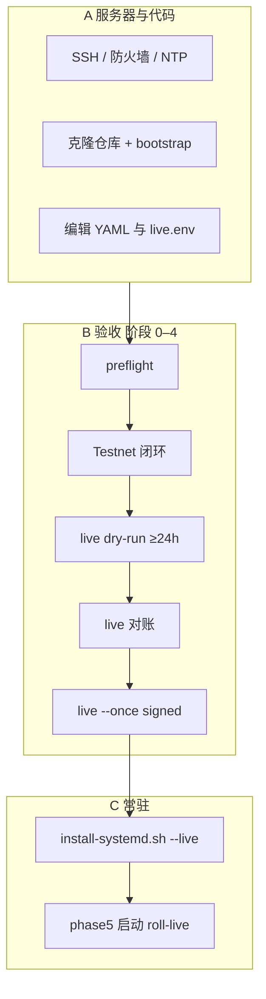

# 云服务器 Live 实盘自动化 — 完整开启流程（USD-M / U 本位）

本文档从**空白 Ubuntu 云服务器**到 **`roll-live.service` 持续自动交易**的端到端步骤。与分阶段验收细节互补：

| 文档 | 用途 |
| --- | --- |
| 本文 | 服务器部署、配置、验收顺序、systemd 常驻 |
| [`live-go-live-acceptance.md`](live-go-live-acceptance.md) | 各阶段通过标准与手动命令 |
| [`checklists/live-go-live-checklist.md`](checklists/live-go-live-checklist.md) | 可打印勾选清单 |

**系统标准：** Binance **USD-M / U 本位 USDT 永续**（`product: usdm`，`/fapi/v1`，live `https://fapi.binance.com`）。

**约定：** 项目根目录记为 `/opt/roll`（可改为你的路径）；**每条** `python -m main …` 前须 `conda activate roll-env`。

---

## 流程总览



---

## A. 服务器准备（一次性）

### A.1 推荐环境

| 项 | 建议 |
| --- | --- |
| OS | Ubuntu 22.04 / 24.04 LTS（x86_64） |
| 配置 | 1 vCPU、1GB RAM 起；策略拉多标的 K 线时建议 2GB+ |
| 网络 | 出站 HTTPS；若 Binance Key 启用 **IP 白名单**，须包含本机公网 IP |
| 时间 | `timedatectl` 显示 `System clock synchronized: yes` |

### A.2 创建运行用户与目录（示例）

```bash
sudo mkdir -p /opt/roll
sudo chown "$USER:$USER" /opt/roll
cd /opt/roll
```

### A.3 获取代码

```bash
cd /opt/roll
git clone <你的仓库 URL> .
# 或 rsync/scp 本机已验收过的仓库（勿带上 config/secrets/*.env）
```

### A.4 引导环境与示例配置

```bash
cd /opt/roll
bash scripts/deploy/bootstrap-ubuntu.sh
```

脚本会：安装/使用 Miniconda、创建 **`roll-env`**、`pip install -e ".[dev]"`、从 `*.example` 复制 testnet/live 配置与密钥模板、设置 `config/secrets` 权限、运行 `pytest`（可用 `ROLL_SKIP_PYTEST=1` 跳过）。

### A.5 填写密钥与审查配置

```bash
nano config/secrets/testnet.env   # Testnet USD-M Key
nano config/secrets/live.env      # 实盘 Key：禁止提现、USD-M 权限、建议 IP 白名单
nano config/settings.testnet.yaml
nano config/settings.live.yaml
```

**隔离核对（必做）：**

| 环境 | `secrets.file` | `state.path` | `rest_base` |
| --- | --- | --- | --- |
| Testnet | `config/secrets/testnet.env` | `data/roll_state_testnet.json` | `https://testnet.binancefuture.com` |
| live | `config/secrets/live.env` | `data/roll_state_live.json` | `https://fapi.binance.com` |

live 在验收完成前保持 `strategy.live_trading_enabled: false`。

### A.6 预检

```bash
conda activate roll-env
cd /opt/roll
bash scripts/acceptance/preflight.sh
```

---

## B. 上线验收（阶段 0–4，不可跳过）

以下命令均在 `/opt/roll`、已 `conda activate roll-env` 下执行。建议固定会话 ID 便于归档：

```bash
export ROLL_ACCEPTANCE_SESSION="live-$(date -u +%Y%m%dT%H%M%SZ)"
```

| 阶段 | 脚本 | 说明 |
| --- | --- | --- |
| 0 | `preflight.sh` | 配置/密钥/路径隔离 |
| 1 | `phase1-testnet-closed-loop.sh` | 须 `testnet_signed_orders_enabled: true` |
| 2 | `phase2-live-dry-run-start.sh` | 前台运行 ≥24h；**勿** `--no-dry-run` |
| 2 检查 | `phase2-live-dry-run-check.sh` | 满 24h 后 Ctrl+C 再执行 |
| 3 | `phase3-live-reconcile.sh` | live 空仓、无挂单 |
| 4 | `phase4-live-first-signed-once.sh` | 须合并极小资金参数并 `live_trading_enabled: true` |

阶段 4 前将 [`config/settings.live.minimal-funds.example.yaml`](../config/settings.live.minimal-funds.example.yaml) 中的保守项合并进 `settings.live.yaml`，账户仅保留可承受全部损失的小额 USDT 保证金。

归档：

```bash
bash scripts/acceptance/collect-session.sh "$ROLL_ACCEPTANCE_SESSION"
# 编辑 logs/acceptance/<会话ID>/record.md
```

**详细通过标准：** [`live-go-live-acceptance.md`](live-go-live-acceptance.md)。

---

## C. 安装 systemd 并启动 Live 常驻

### C.1 安装单元（自动替换路径）

验收阶段 4 人工批准后再安装 live 单元：

```bash
conda activate roll-env
cd /opt/roll

# 仅 live（Testnet 单元若已装可省略）
bash scripts/deploy/install-systemd.sh --live-only

# 或同时安装 Testnet + live
# bash scripts/deploy/install-systemd.sh --live
```

自定义路径示例：

```bash
ROLL_USER=ubuntu ROLL_PROJECT=/opt/roll bash scripts/deploy/install-systemd.sh --live-only
```

### C.2 启动前对账（必做）

```bash
conda activate roll-env
python -m main reconcile-state \
  --config config/settings.live.yaml \
  --secrets-file config/secrets/live.env
```

确认：`nonzero_position_symbols=[]`、`symbols_with_open_orders=[]`、`halt_automatic_trading=False`。

### C.3 启动 live 服务（阶段 5）

```bash
export ROLL_ALLOW_SYSTEMD_START=1
bash scripts/acceptance/phase5-live-systemd-start.sh
```

或手动：

```bash
sudo systemctl start roll-live
sudo systemctl status roll-live
journalctl -u roll-live -n 200 --no-pager
journalctl -u roll-live -f
```

**默认不要** `sudo systemctl enable roll-live`，除非你明确接受**服务器重启后自动恢复实盘**。

### C.4 禁止事项

- **不要**同时运行 `roll-live.service` 与前台 `run-loop --config settings.live.yaml --no-dry-run`
- **不要**在未完成阶段 1–4 时 `start roll-live`
- **不要**在 live 配置中使用 `dapi.binance.com` 或 `/dapi`（COIN-M 已废弃）

---

## D. 日常运维

| 操作 | 命令 |
| --- | --- |
| 查看状态 | `sudo systemctl status roll-live` |
| 停止 | `sudo systemctl stop roll-live` |
| 停止后对账 | `bash scripts/acceptance/phase3-live-reconcile.sh` |
| 最近日志 | `journalctl -u roll-live -n 200 --no-pager` |
| 实时日志 | `journalctl -u roll-live -f` |
| 重启 | `sudo systemctl restart roll-live`（重启前建议对账） |

停止服务**不会**自动平仓。若需清仓：Binance → **U 本位合约 / USD-M Futures** → 撤单并市价平仓，再执行对账。

出现 `halt_automatic_trading=True`、对账与网页不一致、非预期持仓：立即 `stop`，按 Plan 3.0 §11.7 处理，修复后从阶段 3 重来。

---

## E. Testnet 常驻（可选）

Testnet 验收通过后：

```bash
bash scripts/deploy/install-systemd.sh
python -m main reconcile-state --config config/settings.testnet.yaml --secrets-file config/secrets/testnet.env
sudo systemctl start roll-testnet
journalctl -u roll-testnet -f
```

---

## F. 快速命令索引

```bash
# 首次部署
bash scripts/deploy/bootstrap-ubuntu.sh
bash scripts/acceptance/preflight.sh

# 验收链
export ROLL_ACCEPTANCE_SESSION="accept-$(date -u +%Y%m%dT%H%M%SZ)"
bash scripts/acceptance/phase1-testnet-closed-loop.sh
bash scripts/acceptance/phase2-live-dry-run-start.sh   # ≥24h
bash scripts/acceptance/phase2-live-dry-run-check.sh
bash scripts/acceptance/phase3-live-reconcile.sh
# 合并 minimal-funds + live_trading_enabled: true
bash scripts/acceptance/phase4-live-first-signed-once.sh
bash scripts/acceptance/collect-session.sh "$ROLL_ACCEPTANCE_SESSION"

# Live 常驻
bash scripts/deploy/install-systemd.sh --live-only
export ROLL_ALLOW_SYSTEMD_START=1
bash scripts/acceptance/phase5-live-systemd-start.sh
```

---

## 相关文档

- [`README.md`](../README.md)
- [`live-go-live-acceptance.md`](live-go-live-acceptance.md)
- [`scripts/acceptance/README.md`](../scripts/acceptance/README.md)
- [`scripts/deploy/README.md`](../scripts/deploy/README.md)
- [`deploy/systemd/README.md`](../deploy/systemd/README.md)
