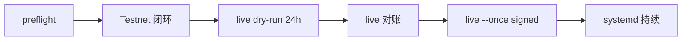

# Live 上线前最终验收与小资金试运行（USD-M / U 本位）

本文档实现 **3.0 USD-M** 上线验收流程（继承 2.0 Prompt 8 的阶段划分）：在**不修改趋势策略模型**的前提下，提供可复制的命令、检查清单与记录模板。验收分五个阶段，**必须按顺序**完成；不得跳过 Testnet 闭环或 live 对账直接 signed 下单。

**当前系统标准：** Binance **USD-M / U 本位 USDT 永续**（`product: usdm`，`/fapi/v1`）。网页操作请在 **U 本位合约 / USD-M Futures** 板块进行，**不是** COIN-M 币本位。

**约定**

- 项目根目录以下记为 `/opt/roll`（本地开发则为仓库根目录）。
- **每一条**执行 `python -m main …` 的 shell 命令前必须先：

```bash
conda activate roll-env
cd /opt/roll   # 或你的仓库路径
```

- 自动化脚本位于 `scripts/acceptance/`（Linux/macOS/WSL）。Windows 开发机请按本文「手动命令」逐条执行。
- 记录模板：`docs/templates/live-acceptance-record.template.md` → 复制到 `logs/acceptance/<会话ID>/record.md`。
- 可打印清单：[`docs/checklists/live-go-live-checklist.md`](checklists/live-go-live-checklist.md)。

---

## 总览

| 阶段 | 目标 | 关键命令 / 脚本 |
| --- | --- | --- |
| 0 预检 | 配置/密钥/状态隔离 | `bash scripts/acceptance/preflight.sh` |
| 1 Testnet | 至少一次开仓→平仓闭环 | `phase1-testnet-closed-loop.sh` |
| 2 Live dry-run | 实盘公共行情连续观察 **≥24h**，不下单 | `phase2-live-dry-run-start.sh` + `phase2-live-dry-run-check.sh` |
| 3 Live 对账 | 成功、无非预期持仓/挂单 | `phase3-live-reconcile.sh` |
| 4 Live 首次 signed | 极小资金、`--once --no-dry-run` | `phase4-live-first-signed-once.sh` |
| 5 systemd | 单轮确认后再常驻 | `sudo systemctl start roll-live` |



---

## 阶段 0：预检

```bash
conda activate roll-env
cd /opt/roll
bash scripts/acceptance/preflight.sh
```

脚本会检查：配置文件存在、`secrets.file` / `state.path` 分离、示例开关提示等。失败项修正后再进入阶段 1。

**手动核对（脚本不代替人工）：**

- live API Key 权限、IP 白名单、提现关闭。
- 服务器时间同步（`timedatectl` 或 `chronyc tracking`）。

---

## 阶段 1：Testnet 开仓→平仓闭环

### 配置

在 `config/settings.testnet.yaml` 中：

```yaml
strategy:
  testnet_signed_orders_enabled: true
```

### 推荐：一键脚本

```bash
conda activate roll-env
cd /opt/roll
export ROLL_ACCEPTANCE_SESSION="$(date -u +%Y%m%dT%H%M%SZ)"
bash scripts/acceptance/phase1-testnet-closed-loop.sh
```

脚本流程：启动前对账 → `run-loop --once --no-dry-run` → 停止后对账 → 将输出写入 `logs/acceptance/<会话ID>/`。

### 手动命令（与脚本等价）

```bash
conda activate roll-env
cd /opt/roll

python -m main reconcile-state \
  --config config/settings.testnet.yaml \
  --secrets-file config/secrets/testnet.env

python -m main run-loop \
  --config config/settings.testnet.yaml \
  --secrets-file config/secrets/testnet.env \
  --once --no-dry-run

python -m main reconcile-state \
  --config config/settings.testnet.yaml \
  --secrets-file config/secrets/testnet.env
```

**可选补充验收**（最小 REST 闭环，不经过策略信号；CLI 名 `coinm-signed-smoke` 为历史保留，实际为 **USD-M Testnet**）：

```bash
conda activate roll-env
python -m main coinm-signed-smoke \
  --config config/settings.testnet.yaml \
  --secrets-file config/secrets/testnet.env \
  --symbol DOGEUSDT
```

### 通过标准

| 输出 / 观察 | 要求 |
| --- | --- |
| 两次对账 `nonzero_position_symbols` | `[]` |
| `symbols_with_open_orders` | `[]` |
| `halt_automatic_trading` | `False` |
| Testnet 网页 **U 本位 / USD-M** | 仓位 0、无挂单 |
| 运行日志 | 出现过开仓与最终至空仓（策略平仓或本轮结束无持仓） |

未通过：不要进入阶段 2。在 Testnet **U 本位合约 / USD-M Futures** 网页撤单/平仓后重新对账。

---

## 阶段 2：Live dry-run（实盘公共行情 ≥24 小时）

本阶段**只读行情、打印 `[dry-run]` 决策**，不向交易所发 signed 单。

### 配置

- `config/settings.live.yaml`：`environment: live`，`binance.product: usdm`，`binance.rest_base: https://fapi.binance.com`，`binance.api_prefix: /fapi/v1`。
- **`strategy.live_trading_enabled` 保持 `false`**（直到阶段 4）。
- 不要加 CLI `--no-dry-run`。

live 配置下 dry-run 使用 `fapi.binance.com` 拉取 USD-M 实盘公共 K 线与 exchangeInfo，满足「实盘公共行情」要求。

### 启动连续观察

```bash
conda activate roll-env
cd /opt/roll
bash scripts/acceptance/phase2-live-dry-run-start.sh
```

脚本会：

1. 写入 `logs/acceptance/dry-run-started-at.txt`（UTC 时间戳）。
2. 前台运行 `run-loop`（循环模式），日志 tee 到 `logs/acceptance/<会话ID>/live-dry-run.log`。

在**单独 SSH 会话**保持运行；或用 `tmux`/`screen` 防止断开。

### 满 24 小时后检查

停止 dry-run（运行终端 `Ctrl+C`），然后：

```bash
conda activate roll-env
bash scripts/acceptance/phase2-live-dry-run-check.sh
```

退出码 `0` 表示已满 24 小时；`1` 表示未满（继续观察）。

### 通过标准

- 连续运行时间 ≥ 24h。
- 每轮扫描无持续 REST 失败；日志无 API Secret。
- `matched=` / 监测标的数 ≥ `min_monitor_symbols`。
- `[dry-run]` 开仓计划与拒绝原因符合你对策略的理解。

---

## 阶段 3：Live 对账（signed 前必做）

```bash
conda activate roll-env
cd /opt/roll
bash scripts/acceptance/phase3-live-reconcile.sh
```

### 手动命令

```bash
conda activate roll-env
python -m main reconcile-state \
  --config config/settings.live.yaml \
  --secrets-file config/secrets/live.env
```

### 通过标准

| 字段 | 安全值 |
| --- | --- |
| `nonzero_position_symbols` | `[]` |
| `symbols_with_open_orders` | `[]` |
| `halt_automatic_trading` | `False` |
| `halt_reason` | `None` 或空字符串 |

脚本退出码：`0` 通过；`1` 存在 halt 或非预期快照（须先人工清理，见 Plan 3.0 §11.7 或 [`docs/滚仓系统实现的plan文档3.0版本.md`](滚仓系统实现的plan文档3.0版本.md)）。

**网页复核（强烈建议）：** Binance → 衍生品 → **U 本位合约 / USD-M Futures** → 仓位 0、当前委托为空。

---

## 阶段 4：Live 首次 signed（极小资金，仅 `--once`）

### 资金与参数（人工）

1. 实盘 USD-M USDT 永续账户仅保留**可承受全部损失**的极小保证金。
2. 将 [`config/settings.live.minimal-funds.example.yaml`](../config/settings.live.minimal-funds.example.yaml) 中的保守项合并进你的 `config/settings.live.yaml`（**不改趋势模型代码**）。
3. 设置 `strategy.live_trading_enabled: true`。

### 禁止重复 live 进程

```bash
sudo systemctl status roll-live || true
pgrep -af "run-loop.*settings.live.yaml" || true
ls -l data/roll_state_live.json.lock 2>/dev/null || echo "无锁文件"
```

应无其它 live signed 进程。

### 推荐：单轮脚本

```bash
conda activate roll-env
cd /opt/roll
export ROLL_ACCEPTANCE_SESSION="live-once-$(date -u +%Y%m%dT%H%M%SZ)"
bash scripts/acceptance/phase4-live-first-signed-once.sh
```

等价于：**对账 → `run-loop --once --no-dry-run` → 停止后对账**。

### 手动命令

```bash
conda activate roll-env
python -m main reconcile-state \
  --config config/settings.live.yaml \
  --secrets-file config/secrets/live.env

python -m main run-loop \
  --config config/settings.live.yaml \
  --secrets-file config/secrets/live.env \
  --once --no-dry-run

python -m main reconcile-state \
  --config config/settings.live.yaml \
  --secrets-file config/secrets/live.env
```

### 归档与人工记录

```bash
conda activate roll-env
bash scripts/acceptance/collect-session.sh "$ROLL_ACCEPTANCE_SESSION"
```

编辑 `logs/acceptance/<会话ID>/record.md`（从模板复制），填写当次成交、日志摘要、对账原文、人工复查结论。

### 通过标准

- 单轮日志与 Testnet / dry-run 行为一致，无意外重复下单。
- 停止后对账与网页均为空仓、无挂单。
- 已保存交易摘要与复查签字。

---

## 阶段 5：移交 systemd 持续运行

**仅在阶段 4 人工批准后进行。**

1. 再次对账：`bash scripts/acceptance/phase3-live-reconcile.sh`
2. 确认**没有**前台 `run-loop --no-dry-run` 与 `roll-live.service` 同时运行。
3. 启动：

```bash
sudo systemctl start roll-live
sudo systemctl status roll-live
journalctl -u roll-live -n 200 --no-pager
```

4. **默认不要** `sudo systemctl enable roll-live`，除非你明确接受服务器重启后自动恢复实盘进程。

停止：`sudo systemctl stop roll-live` → 立即 `phase3-live-reconcile.sh` → 网页复核。

详见 [`deploy/systemd/README.md`](../deploy/systemd/README.md) 与 Plan 3.0 §11.5–§11.7。

---

## 如何判断是否可以持续运行

在**同时满足**以下条件后，才可 `systemctl start roll-live`（或前台去掉 `--once`）：

| 维度 | 条件 |
| --- | --- |
| 验收阶段 | 阶段 1–4 均已完成并记录在案 |
| 对账 | `reconcile-state` 空仓、无挂单、`halt=False` |
| 行为 | 单轮 live 与 dry-run / Testnet 决策逻辑一致，无异常 halt |
| 资金 | 仍为可承受亏损的小资金；参数未在未验收情况下大幅改动 |
| 进程 | 仅一路 live；锁文件无残留冲突 |
| 运维 | 值班人知晓停服、网页平仓、对账命令 |
| 人工 | `record.md` 中「批准进入 systemd 常驻」已勾选 |

若出现：`halt_automatic_trading=True`、对账与网页不一致、连续 API 失败、非预期开仓 — **不要** 常驻；`stop` 后按 Plan 3.0 §11.7 在 **USD-M / U 本位** 网页处理，修复后从阶段 3 重来。

---

## 相关文档

- **当前标准（3.0 USD-M）**：[`docs/滚仓系统实现的plan文档3.0版本.md`](滚仓系统实现的plan文档3.0版本.md)（§11 使用方法、§12 检查清单与应急）
- 日常使用：[`README.md`](../README.md)
- systemd：[`deploy/systemd/README.md`](../deploy/systemd/README.md)
- **历史（COIN-M，勿用于当前配置）**：[`docs/滚仓系统实现的plan文档2.0版本.md`](滚仓系统实现的plan文档2.0版本.md)
