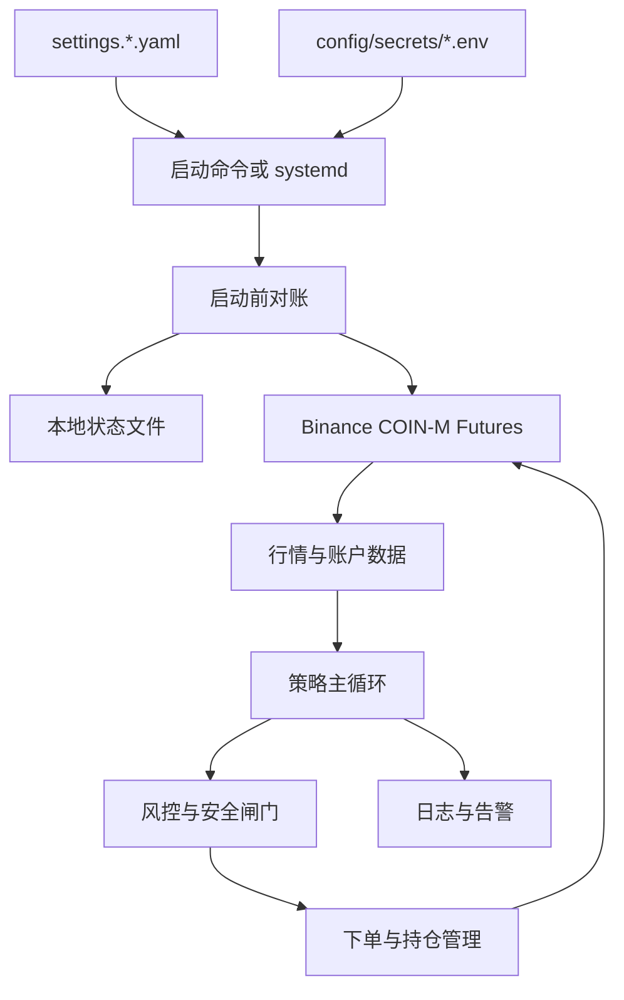

# 滚仓系统实现的 Plan 文档 2.0 版本

> 本文档用于在现有 1.0 系统基础上继续实施 2.0：接入 Binance COIN-M Futures 实盘 live 自动交易、改造本地密钥文件管理、部署到 Ubuntu 云服务器，并给出可复制给 Cursor 逐阶段执行的 prompts。本文档只描述计划、验收方式和使用方法，不包含代码。

## 1. 2.0 背景与边界

当前 1.0 系统已经完成原计划第 10 节的所有阶段与验收，具备以下能力：

- 支持 `dry-run` 策略循环，不向交易所发 signed 订单。
- 支持 Binance COIN-M Futures Testnet signed 自动交易闭环。
- 支持趋势模型离线验收、回测、参数校准、状态对账与单标的交易锁。
- 当前 `run-loop --no-dry-run` 只允许 Testnet host，实盘 signed 自动交易仍被代码侧阻断。
- 当前 signed 命令从终端环境变量 `BINANCE_API_KEY` / `BINANCE_API_SECRET` 读取密钥。

2.0 的边界非常明确：

- 不修改现有趋势策略模型，不重写信号评分、不改模型数学逻辑。
- 重点实施实盘 live 自动交易的工程能力、安全闸门、密钥管理、云服务器运维和使用文档。
- Testnet 和 live 必须严格分离，不能混用配置、密钥、状态文件和运行服务。
- 系统最终目标是完全自动交易并盈利，但任何系统都不能保证盈利。2.0 的目标是把自动化、风控、可观测性和实盘操作纪律做到足够稳健，使系统具备小资金实盘试运行条件。

## 2. 2.0 总目标

2.0 完成后，系统应满足：

1. 可以在 Ubuntu 云服务器上通过 SSH 命令行安装、配置、启动、停止和排障。
2. Testnet 与 live 的 API Key / Secret 均存放在服务器本地文件中，而不是依赖交互式终端会话临时设置环境变量。
3. Testnet 自动交易仍可完整运行，并作为 live 上线前的必经验收环境。
4. live 自动交易必须由多重显式开关启用，默认关闭。
5. live 自动交易必须在启动前执行交易所对账，确认本地状态与交易所真实持仓一致。
6. 任意时刻仍只允许交易一个标的。
7. 策略进程可由 `systemd` 托管，支持 SSH 下启动、停止、重启、查看日志和开机自启。
8. 出现异常时优先保护账户：停止开新仓、保留对已有持仓的管理能力，必要时由人工在交易所网页或 App 手动撤单平仓。

## 3. 2.0 架构设计

### 3.1 环境分层

2.0 建议明确拆成三个运行层级：

| 层级 | 用途 | 是否下真实资金订单 |
| --- | --- | --- |
| dry-run | 读取行情、计算信号、输出决策，不下单 | 否 |
| testnet | Binance Futures Testnet signed 自动交易 | 否，Testnet 资金 |
| live | Binance COIN-M Futures 实盘 signed 自动交易 | 是 |

三层共用策略模型，但使用不同配置和密钥：

- `config/settings.testnet.yaml`：Testnet 自动交易配置。
- `config/settings.live.yaml`：实盘自动交易配置。
- `config/secrets/testnet.env`：Testnet API Key / Secret。
- `config/secrets/live.env`：live API Key / Secret。
- `data/roll_state_testnet.json`：Testnet 状态文件。
- `data/roll_state_live.json`：live 状态文件。

### 3.2 数据流



### 3.3 live 安全闸门

live 自动交易不能只靠一个配置项开启，必须同时满足：

1. 配置文件中 `environment: live`。
2. `binance.rest_base` 必须是 `https://dapi.binance.com`。
3. `strategy.live_trading_enabled: true`。
4. `strategy.testnet_signed_orders_enabled` 不参与 live 放行，避免语义混淆。
5. 启动命令显式带 `--no-dry-run`。
6. 启动命令或配置显式指定 live 密钥文件。
7. live API Key 必须来自 live 密钥文件，不能从 Testnet 密钥文件读取。
8. 启动前必须完成 `reconcile-state` 对账。
9. 若对账发现多标的持仓、跨标的挂单或本地状态异常，必须拒绝启动自动开新仓。
10. 默认最大风险参数应比 Testnet 更保守，实盘初期必须小资金运行。

## 4. 本地密钥文件方案

2.0 要求 API Key 和 Secret 放到本地文件，不再要求用户在终端会话中手动设置环境变量。

推荐目录：

```text
config/secrets/
  testnet.env
  live.env
```

推荐文件格式：

```text
BINANCE_API_KEY=你的_key
BINANCE_API_SECRET=你的_secret
```

安全要求：

- `config/secrets/` 必须加入 `.gitignore`。
- `config/secrets/*.env` 权限建议为 `600`，只允许当前运行用户读取。
- 日志、异常、测试输出中禁止打印 Secret。
- live 与 Testnet 使用完全不同的 API Key。
- live Key 禁止提现权限。
- live Key 优先配置 IP 白名单，只允许云服务器公网 IP 使用。
- 密钥泄漏时必须立即在 Binance 后台删除 Key，不能只在服务器上删除文件。

建议 2.0 支持以下读取方式：

- CLI 参数：`--secrets-file config/secrets/testnet.env` 或 `--secrets-file config/secrets/live.env`。
- 配置字段：`secrets.file: ./config/secrets/testnet.env`。
- `systemd` 服务：通过 `EnvironmentFile=/path/to/config/secrets/live.env` 加载。

如果同时存在 CLI 参数、配置字段和 `EnvironmentFile`，建议优先级为：

1. CLI `--secrets-file`
2. 配置文件 `secrets.file`
3. 进程环境变量

这样既满足本地文件化，又兼容 `systemd` 的标准运维方式。

## 5. 配置文件规划

### 5.1 Testnet 配置

Testnet 配置应保持默认安全：

```yaml
environment: testnet

binance:
  rest_base: "https://testnet.binancefuture.com"
  coin_m_prefix: "/dapi/v1"
  recv_window_ms: 5000

secrets:
  file: "./config/secrets/testnet.env"

strategy:
  testnet_signed_orders_enabled: true
  live_trading_enabled: false
  loop_interval_sec: 120
```

### 5.2 live 配置

live 配置必须清晰表达真实资金风险：

```yaml
environment: live

binance:
  rest_base: "https://dapi.binance.com"
  coin_m_prefix: "/dapi/v1"
  recv_window_ms: 5000

secrets:
  file: "./config/secrets/live.env"

strategy:
  testnet_signed_orders_enabled: false
  live_trading_enabled: true
  loop_interval_sec: 120
```

live 初期建议额外采用保守参数：

- 降低单笔风险资金比例。
- 降低最大仓位上限。
- 使用较宽但可控的止损与更严格的入场过滤。
- 先只启用 3 个流动性较好、合约规则明确的标的。
- 先运行 `--once --no-dry-run` 单轮验收，再交给 `systemd` 常驻运行。

## 6. live 自动交易实施要求

2.0 不改变策略模型，只把现有 Testnet signed 自动交易能力扩展到 live。

实现时应遵守：

1. 复用现有 Binance COIN-M signed client、订单执行、持仓管理、交易锁和状态存储能力。
2. 将 Testnet-only 守卫改造成 environment-aware 守卫：
   - Testnet 只允许 `https://testnet.binancefuture.com`。
   - live 只允许 `https://dapi.binance.com`。
3. `reconcile-state` 必须支持 Testnet 和 live，但默认仍不应误连 live。
4. live 自动交易必须读取 live 专用状态文件，不能复用 Testnet 状态文件。
5. `coinm-signed-smoke` 若扩展到 live，必须避免随意开仓；live 验收应以账户信息、持仓查询、交易规则查询、极小额人工确认流程为主。
6. 下单、平仓、撤单、止损、异常暂停等行为要保持与 Testnet 路径一致。
7. 错误日志必须包含 endpoint、symbol、错误码、错误消息和本地动作，但不得包含 Secret。

## 7. Ubuntu 云服务器部署方案

### 7.1 基础假设

- 云服务器系统：Ubuntu。
- 用户只能通过 SSH 命令行控制服务器。
- 项目目录示例：`/opt/roll`。
- Conda 环境名：`roll-env`。
- 运行用户示例：`ubuntu` 或单独创建的 `roll` 用户。

### 7.2 首次部署步骤

在云服务器上：

```bash
ssh ubuntu@你的服务器IP
cd /opt/roll
conda activate roll-env
pip install -e ".[dev]"
cp config/settings.example.yaml config/settings.testnet.yaml
cp config/settings.example.yaml config/settings.live.yaml
mkdir -p config/secrets data logs
chmod 700 config/secrets
```

创建密钥文件：

```bash
nano config/secrets/testnet.env
chmod 600 config/secrets/testnet.env

nano config/secrets/live.env
chmod 600 config/secrets/live.env
```

### 7.3 前台调试命令

Testnet 对账：

```bash
conda activate roll-env
python -m main reconcile-state --config config/settings.testnet.yaml --secrets-file config/secrets/testnet.env
```

Testnet 单轮自动交易：

```bash
conda activate roll-env
python -m main run-loop --config config/settings.testnet.yaml --secrets-file config/secrets/testnet.env --once --no-dry-run
```

Testnet 持续自动交易：

```bash
conda activate roll-env
python -m main run-loop --config config/settings.testnet.yaml --secrets-file config/secrets/testnet.env --no-dry-run
```

live 对账：

```bash
conda activate roll-env
python -m main reconcile-state --config config/settings.live.yaml --secrets-file config/secrets/live.env
```

live 单轮自动交易：

```bash
conda activate roll-env
python -m main run-loop --config config/settings.live.yaml --secrets-file config/secrets/live.env --once --no-dry-run
```

live 持续自动交易：

```bash
conda activate roll-env
python -m main run-loop --config config/settings.live.yaml --secrets-file config/secrets/live.env --no-dry-run
```

### 7.4 systemd 托管

仓库已提供可安装的单元模板（**不修改策略模型**）：

| 服务 | 仓库路径 | 安装到服务器 |
| --- | --- | --- |
| Testnet | `deploy/systemd/roll-testnet.service` | `/etc/systemd/system/roll-testnet.service` |
| live | `deploy/systemd/roll-live.service` | `/etc/systemd/system/roll-live.service` |

运维说明见 **`§8 云服务器应急与运维手册`**、`deploy/systemd/README.md` 与根目录 `README.md`「Ubuntu 云服务器：systemd 托管」。

Testnet 服务职责：

- 在 `WorkingDirectory`（项目根，如 `/opt/roll`）运行。
- 使用 `roll-env` 的 Python：`…/miniconda3/envs/roll-env/bin/python`（等价 `conda activate roll-env`）。
- 使用 `config/settings.testnet.yaml` 与 `--secrets-file config/secrets/testnet.env`。
- `EnvironmentFile` 加载 `config/secrets/testnet.env`。
- 写入 `data/roll_state_testnet.json`。
- 只连接 Testnet REST。

live 服务职责：

- 同上目录与 Python 约定。
- 使用 `config/settings.live.yaml` 与 `--secrets-file config/secrets/live.env`。
- `EnvironmentFile` 加载 `config/secrets/live.env`。
- 写入 `data/roll_state_live.json`。
- 只连接 live REST。

服务启动前**必须**先人工执行一次对账；对账失败时不应 `systemctl start` signed 服务。

**安装：**

```bash
conda activate roll-env
cd /opt/roll
# 编辑 deploy/systemd/*.service 中的 User、WorkingDirectory、Python 绝对路径
sudo cp deploy/systemd/roll-testnet.service /etc/systemd/system/
sudo cp deploy/systemd/roll-live.service /etc/systemd/system/
sudo systemctl daemon-reload
```

**live 默认不开机自启**：仅 `sudo systemctl start roll-live`；不要默认 `enable roll-live`。小资金试运行稳定后，若确需重启自启，再显式 `sudo systemctl enable roll-live`。

**常用命令（Testnet 将单元名换为 `roll-live` 即适用于实盘）：**

| 操作 | 命令 |
| --- | --- |
| 启动 | `sudo systemctl start roll-testnet` |
| 停止 | `sudo systemctl stop roll-testnet` |
| 重启 | `sudo systemctl restart roll-testnet` |
| 状态 | `sudo systemctl status roll-testnet` |
| 最近日志 | `journalctl -u roll-testnet -n 200 --no-pager` |
| 跟踪日志 | `journalctl -u roll-testnet -f` |
| 禁用开机自启 | `sudo systemctl disable roll-testnet` |

`ExecStart` 同时指定 `--secrets-file` 与 `EnvironmentFile`，两种方式只读取**当前环境**的密钥，且必须与 `--config` 一致。

## 8. 云服务器应急与运维手册（仅 SSH）

> 本节面向**只能通过 SSH 登录 Ubuntu 云服务器**的运维场景。下文默认项目目录为 `/opt/roll`、运行用户为 `ubuntu`、Conda 环境名为 `roll-env`；若你安装时使用了其它路径，请替换命令中的目录与用户名。
>
> **重要：停止策略进程 ≠ 自动平仓。** 进程退出后，交易所上的持仓与未成交委托仍以 Binance 为准；必须用对账命令与交易所页面双重确认。
>
> systemd 安装细节另见 `deploy/systemd/README.md` 与根目录 `README.md`「Ubuntu 云服务器：systemd 托管」。

### 8.0 通用约定

| 约定 | 说明 |
| --- | --- |
| SSH 登录 | `ssh ubuntu@你的服务器IP` |
| 项目目录 | `cd /opt/roll` |
| Conda | **每一条**需要执行 `python -m main …` 的命令前，必须先执行 `conda activate roll-env` |
| systemd | `systemctl` / `journalctl` 使用 `sudo`，**不需要** conda（服务内已使用 `roll-env` 的 Python） |
| 环境隔离 | Testnet 用 `settings.testnet.yaml` + `testnet.env` + `roll_state_testnet.json`；live 用 `settings.live.yaml` + `live.env` + `roll_state_live.json`，禁止混用 |

**对账命令（只读交易所、不下单）是停止后确认持仓/挂单的首选方式：**

```bash
conda activate roll-env
cd /opt/roll
# Testnet：
python -m main reconcile-state --config config/settings.testnet.yaml --secrets-file config/secrets/testnet.env
# live：
python -m main reconcile-state --config config/settings.live.yaml --secrets-file config/secrets/live.env
```

对账输出中应关注（详见 §8.3）：

- `nonzero_position_symbols=[]` → 无持仓
- `symbols_with_open_orders=[]` → 无未完成委托
- `reconcile=... halt_automatic_trading=False` → 未因异常快照挂起自动交易
- `halt_reason=None` 或 `halt_reason=''` → 无 halt 原因（若有内容须按原因人工处理后再启动）

---

### 8.1 通过 SSH 启动与停止 Testnet

#### 8.1.1 方式 A：systemd（推荐常驻）

**启动前（必做，首次或停机后）：**

```bash
ssh ubuntu@你的服务器IP
cd /opt/roll
conda activate roll-env
python -m main reconcile-state --config config/settings.testnet.yaml --secrets-file config/secrets/testnet.env
```

确认对账输出无非预期持仓/挂单，且 `halt_automatic_trading=False` 后：

```bash
sudo systemctl start roll-testnet
sudo systemctl status roll-testnet
```

**停止：**

```bash
sudo systemctl stop roll-testnet
sudo systemctl status roll-testnet
```

`status` 中应显示 `inactive (dead)`。停止后按 §8.3 执行 Testnet 对账。

**可选开机自启（验收稳定后）：**

```bash
sudo systemctl enable roll-testnet
```

#### 8.1.2 方式 B：SSH 前台调试

适合单轮验收或临时观察（**不要**与 `roll-testnet.service` 同时跑同一套 Testnet signed 配置）：

```bash
ssh ubuntu@你的服务器IP
cd /opt/roll
conda activate roll-env
python -m main reconcile-state --config config/settings.testnet.yaml --secrets-file config/secrets/testnet.env
python -m main run-loop --config config/settings.testnet.yaml --secrets-file config/secrets/testnet.env --no-dry-run
```

单轮：在 `run-loop` 后加 `--once`。

**停止前台进程：** 在运行 `run-loop` 的终端按 `Ctrl+C`，然后执行 §8.3 的 Testnet 对账。

---

### 8.2 通过 SSH 启动与停止 live（实盘）

#### 8.2.1 启动前检查（人工逐项确认）

1. Binance **live** API Key：**禁止提现**；已配置云服务器公网 IP **白名单**（若启用）。
2. `config/settings.live.yaml`：`environment: live`，`binance.rest_base: "https://dapi.binance.com"`，`strategy.live_trading_enabled: true`。
3. 密钥与状态：`config/secrets/live.env`（权限 `600`）、`data/roll_state_live.json` 与 Testnet **完全分离**。
4. **没有**正在运行的第二个 live 进程（§8.6）。
5. 对账通过、无非预期持仓与挂单（§8.3）。

**首次或小资金验收建议先前台单轮，再交给 systemd：**

```bash
ssh ubuntu@你的服务器IP
cd /opt/roll
conda activate roll-env
python -m main reconcile-state --config config/settings.live.yaml --secrets-file config/secrets/live.env
python -m main run-loop --config config/settings.live.yaml --secrets-file config/secrets/live.env --once --no-dry-run
```

#### 8.2.2 方式 A：systemd 持续运行

对账通过后：

```bash
sudo systemctl start roll-live
sudo systemctl status roll-live
```

**停止：**

```bash
sudo systemctl stop roll-live
sudo systemctl status roll-live
```

停止后**立即**按 §8.3 执行 live 对账；若仍有持仓或挂单，按 §8.4 在 Binance 网页手动处理。

**live 默认不要开机自启。** 仅在你明确接受「服务器重启后自动恢复实盘进程」时：

```bash
sudo systemctl enable roll-live
```

#### 8.2.3 方式 B：SSH 前台持续运行

```bash
conda activate roll-env
cd /opt/roll
python -m main reconcile-state --config config/settings.live.yaml --secrets-file config/secrets/live.env
python -m main run-loop --config config/settings.live.yaml --secrets-file config/secrets/live.env --no-dry-run
```

**停止：** `Ctrl+C`，然后 §8.3 live 对账。

---

### 8.3 停止服务后如何确认无持仓、无挂单

**原则：** 最终以 **Binance 交易所页面** 与 **`reconcile-state` 输出** 一致为准；本地 JSON 状态文件不能代替交易所真相。

#### 8.3.1 命令行对账（推荐）

**Testnet 停止后：**

```bash
conda activate roll-env
cd /opt/roll
python -m main reconcile-state --config config/settings.testnet.yaml --secrets-file config/secrets/testnet.env
```

**live 停止后：**

```bash
conda activate roll-env
cd /opt/roll
python -m main reconcile-state --config config/settings.live.yaml --secrets-file config/secrets/live.env
```

**「空仓且无挂单」的判据：**

| 输出字段 | 安全值 | 含义 |
| --- | --- | --- |
| `nonzero_position_symbols` | `[]` | 交易所 COIN-M 无净持仓 |
| `symbols_with_open_orders` | `[]` | 无未成交委托 |
| `halt_automatic_trading`（在 `reconcile=` 行） | `False` | 未因多标的持仓、跨标的挂单等触发 halt |
| `halt_reason` | `None` 或空 | 无待处理 halt 原因 |

若 `nonzero_position_symbols` 或 `symbols_with_open_orders` **非空**，或 `halt_automatic_trading=True`：**不要**再 `systemctl start` 对应 signed 服务；先 §8.4（live）或在 Testnet 网页处理，再重新对账直到上表全部为安全值。

对账会写回对应环境的 `state.path`（如 `data/roll_state_live.json`），并打印 `saved_state_json=...`。

#### 8.3.2 交易所网页复核（强烈建议）

- **Testnet：** 登录 [Binance Futures Testnet](https://testnet.binancefuture.com) → **COIN-M**（币本位合约）→ **仓位** 为 0 → **当前委托** 无挂单。
- **live：** 登录 [Binance](https://www.binance.com) → **衍生品** → **币本位合约（COIN-M）** → 同上确认。

网页与对账不一致时，**以网页为准**处理风险，处理完再对账。

---

### 8.4 live 仍有持仓或挂单：Binance COIN-M Futures 手动撤单与平仓

本仓库**不提供**一键应急平仓 CLI；live 真实资金场景必须在 **Binance 官网 / App** 操作。

#### 8.4.1 操作顺序（不要颠倒）

1. **先停止 live 策略进程**（避免与人工单冲突）  
   `sudo systemctl stop roll-live`，或前台 `Ctrl+C`。  
   用 §8.6 确认无第二个 live `run-loop`。
2. **登录 Binance 实盘账户**（非 Testnet）。
3. 进入 **衍生品 → 币本位合约（COIN-M Futures）**（英文界面多为 **Derivatives → COIN-M Futures**）。
4. **撤销挂单（必须先做）**  
   - 打开 **当前委托 / Open Orders**（或 **条件委托** 若使用 STOP 等）。  
   - 筛选仍有持仓的 **合约 symbol**（如 `DOGEUSD_PERP`）。  
   - 对该 symbol **撤销全部**未成交单（含 STOP_MARKET、限价、只减仓单等）；可使用「全部撤单」若界面提供且你确认范围正确。  
   - **目的：** 避免手动平仓后仍有止损/条件单触发开反向仓。
5. **平仓**  
   - 打开 **仓位 / Positions**。  
   - 找到目标合约，使用 **市价平仓 / Market Close** 或 **平仓 / Close Position**（以界面文案为准）。  
   - 双向持仓模式下请对 **实际有数量的方向** 平仓，避免留下对冲腿。
6. **复查**  
   - 仓位页该 symbol **数量为 0**；当前委托 **为空**。
7. **回到 SSH 再次 live 对账**（§8.3.1），确认：  
   `nonzero_position_symbols=[]`、`symbols_with_open_orders=[]`、`halt_automatic_trading=False`。

#### 8.4.2 注意

- COIN-M 为**币本位**合约，与 U 本位（USD-M）账户分离；务必在 **COIN-M** 板块操作。
- 市价平仓有滑点；极端行情下成交价可能差于标记价。
- 若对账仍报多标的持仓或 `halt_reason` 含跨品种挂单，须在网页逐项清理后重复对账，**不要**在未清理前启动 `roll-live`。

Testnet 应急步骤相同，但登录 **Testnet 站点** 与 Testnet 对账命令（`settings.testnet.yaml`）。

---

### 8.5 日志、重启服务、禁用开机自启

以下 `journalctl` / `systemctl` 命令在 SSH 中执行即可，**无需** `conda activate`。

#### 8.5.1 查看最近 200 行日志

```bash
journalctl -u roll-testnet -n 200 --no-pager
journalctl -u roll-live -n 200 --no-pager
```

#### 8.5.2 持续跟踪日志（排障时常用）

```bash
journalctl -u roll-testnet -f
# 或
journalctl -u roll-live -f
```

按 `Ctrl+C` 退出跟踪（不会停止服务）。

本次启动以来的日志：`journalctl -u roll-live -b`（Testnet 将单元名改为 `roll-testnet`）。

#### 8.5.3 重启服务

重启前建议先对账，确认无异常 halt：

```bash
conda activate roll-env
cd /opt/roll
python -m main reconcile-state --config config/settings.live.yaml --secrets-file config/secrets/live.env
```

```bash
sudo systemctl restart roll-testnet
sudo systemctl restart roll-live
sudo systemctl status roll-testnet   # 或 roll-live
```

#### 8.5.4 禁用开机自启

防止服务器重启后自动拉起策略（**live 默认应 disable**）：

```bash
sudo systemctl disable roll-testnet
sudo systemctl disable roll-live
```

查看是否已启用自启：`systemctl is-enabled roll-live`（输出 `disabled` 为未开机自启）。

---

### 8.6 禁止同时运行多个 live 自动交易进程

**同一 live 账户在同一时刻只能有一个 signed 自动交易进程**（一个 `roll-live.service` **或** 一个前台 `run-loop --no-dry-run`，不能两者并存，也不能两个 service、两个前台）。

程序在 `data/roll_state_live.json` 旁使用互斥锁 `data/roll_state_live.json.lock`；第二个 live 进程启动时会报错并退出，但**不应依赖报错来纠错**——重复进程可能导致抢单、重复下单风险。

**禁止的组合示例：**

- `sudo systemctl start roll-live` **且** SSH 前台 `python -m main run-loop ... settings.live.yaml ... --no-dry-run`
- 两个 SSH 会话各跑一个 live `run-loop --no-dry-run`
- 旧进程未停干净又 `systemctl start`

**启动 live 前检查：**

```bash
sudo systemctl status roll-live
pgrep -af "run-loop.*settings.live.yaml" || true
ls -l /opt/roll/data/roll_state_live.json.lock 2>/dev/null || echo "无锁文件（通常表示无 live 进程持有锁）"
```

应只有**一路** live：要么 `systemctl` 显示 `active (running)` 且无多余 `run-loop`，要么全部为 stopped/无进程。

**正确切换方式：** 先 `sudo systemctl stop roll-live`（或停掉前台 `Ctrl+C`）→ 确认 §8.3 → 再启动另一种方式。

Testnet 同理：不要同时运行 `roll-testnet.service` 与前台 Testnet `run-loop --no-dry-run`。

---

### 8.7 仅 SSH 场景速查：运行、停止、排障、应急平仓

| 目标 | 做法 |
| --- | --- |
| **运行 Testnet** | 对账 → `sudo systemctl start roll-testnet`（或前台 `run-loop`，二选一） |
| **停止 Testnet** | `sudo systemctl stop roll-testnet` 或前台 `Ctrl+C` → Testnet 对账 → 网页复核 |
| **运行 live** | 完成 §8.2.1 检查 → 对账 → 建议 `--once` 验收 → `sudo systemctl start roll-live` |
| **停止 live** | `sudo systemctl stop roll-live` 或 `Ctrl+C` → live 对账 |
| **确认空仓** | `reconcile-state` 见 §8.3 + Binance COIN-M 网页 |
| **应急平仓（live）** | 停进程 → 网页 COIN-M **先撤单再市价平仓** → SSH 再对账 |
| **看日志** | `journalctl -u roll-live -n 200 --no-pager` / `-f` |
| **重启** | 对账 → `sudo systemctl restart roll-live` |
| **禁止重启自启 live** | `sudo systemctl disable roll-live` |
| **排障** | `status` + `journalctl -f` + 对账输出中的 `halt_reason`；禁止在未平仓时强行 `start` |

---

### 8.8 常见排障（仍只需 SSH）

| 现象 | 可能原因 | 处理 |
| --- | --- | --- |
| `systemctl start roll-live` 失败 | 对账未做、配置/密钥错误、已有 live 进程 | `status` + `journalctl -u roll-live -n 50`；§8.6 清重复进程；修正配置后对账再启 |
| 启动报「已有其它 live 进程」 | 重复 live | `stop roll-live`；`pgrep -af run-loop`；结束残留进程后再启 |
| 对账 `halt_automatic_trading=True` | 多标的持仓、跨标的挂单、异常快照 | 读 `halt_reason`；网页清理；再对账 |
| 停止后仍有持仓 | **正常**：停止不平仓 | §8.4 网页撤单平仓 |
| 日志无新输出 | 服务未运行或卡住 | `systemctl status`；`journalctl -f`；必要时 `restart` 前先对账 |
| API / 鉴权错误 | IP 白名单、密钥文件、环境混用 | 确认 `live.env` 与 `settings.live.yaml` 配对；Binance 后台检查 Key 与 IP |

所有需要调用 `python -m main` 的排障步骤，仍须先 `conda activate roll-env`。

## 9. 实盘上线检查清单

live 首次启动前逐项确认：

- [ ] 已在 Testnet 跑通至少一次完整开仓、持仓管理、止损或退出、平仓闭环。
- [ ] 已在 Testnet 验证进程停止、网络中断、重启后的对账恢复。
- [ ] 已在 dry-run 使用 live 公共行情观察至少 24 小时，确认候选标的和信号日志正常。
- [ ] live API Key 禁止提现。
- [ ] live API Key 使用 IP 白名单。
- [ ] live 密钥文件权限为 `600`。
- [ ] live 配置文件与 Testnet 配置文件分离。
- [ ] live 状态文件与 Testnet 状态文件分离。
- [ ] live 初始资金很小，能够接受全部损失。
- [ ] 已记录手动撤单和平仓步骤。
- [ ] 已确认系统不会同时运行两个 live 进程（见 §8.6）。
- [ ] 已确认 `systemd` 中只有一个 `roll-live` 服务实例。
- [ ] 已确认服务器时间同步正常。
- [ ] 已确认日志不会打印 Secret。
- [ ] 已确认异常时系统会 halt 或 pause，而不是继续盲目开新仓。

## 10. Cursor 分阶段 Prompts 与验收

下面 prompts 可按顺序复制给 Cursor 执行。每个 prompt 完成后，都要求 Cursor 汇报实现内容和验收方式。所有涉及终端命令的阶段，在执行命令前都必须先执行 `conda activate roll-env`。

### Prompt 1：密钥文件读取与安全保护

```text
请在现有滚仓系统中实现本地密钥文件读取能力，但不要修改策略模型。
要求：
1. 支持从 CLI 参数 --secrets-file 读取 Binance API Key / Secret。
2. 支持从配置字段 secrets.file 读取密钥文件。
3. 保留进程环境变量作为兼容 fallback，但文档和默认用法应优先使用本地文件。
4. 密钥文件格式使用 BINANCE_API_KEY=... 和 BINANCE_API_SECRET=...。
5. 不允许在日志、异常、测试输出中打印 Secret。
6. 更新 config/env.example 或新增 secrets 示例模板时，只能放占位符，不能放真实密钥。
7. 确保 config/secrets/ 或等价密钥目录不会被 Git 提交。
8. 所有终端命令执行前必须先执行 conda activate roll-env。
完成后告诉我：密钥读取优先级是什么、哪些命令已经支持 --secrets-file、如何验收 Secret 不会被打印。
```

验收：

- 使用 `--secrets-file config/secrets/testnet.env` 可以运行 Testnet signed smoke 或对账。
- 不设置终端环境变量时，程序仍可从密钥文件读取 Key。
- 密钥文件缺失、字段缺失、格式错误时输出清晰错误。
- 测试和日志中不出现 Secret 明文。

### Prompt 2：拆分 Testnet / live 配置与状态

```text
请为 2.0 拆分 Testnet 和 live 的配置与状态文件，但不要修改策略模型。
要求：
1. 新增或完善 config/settings.testnet.example.yaml。
2. 新增或完善 config/settings.live.example.yaml。
3. Testnet 配置使用 https://testnet.binancefuture.com。
4. live 配置使用 https://dapi.binance.com。
5. Testnet 和 live 的 secrets.file 必须指向不同文件。
6. Testnet 和 live 的 state.path 必须指向不同 JSON 文件。
7. live_trading_enabled 默认仍为 false；示例中必须明确只有用户审查后才能改为 true。
8. README 中说明如何复制 example 文件为实际本地配置。
9. 所有终端命令执行前必须先执行 conda activate roll-env。
完成后告诉我：新增了哪些配置文件、Testnet/live 如何隔离、如何验收不会混用状态和密钥。
```

验收：

- Testnet 与 live 示例配置路径清晰分离。
- 默认配置不会误启用 live 自动交易。
- 本地实际配置文件不应提交 Git。
- `pytest` 通过。

### Prompt 3：environment-aware signed 守卫

```text
请把当前 Testnet-only signed 守卫改造为 environment-aware 守卫，但不要修改策略模型。
要求：
1. environment=testnet 时，只允许 Testnet REST host 发 signed 单。
2. environment=live 时，只允许 https://dapi.binance.com 发 signed 单。
3. environment=live 必须同时满足 strategy.live_trading_enabled=true。
4. environment=testnet 必须同时满足 strategy.testnet_signed_orders_enabled=true。
5. --no-dry-run 在不满足安全条件时必须拒绝启动并说明原因。
6. 错误信息必须明确当前 environment、rest_base、缺失的安全开关。
7. 保留 dry-run 能力，dry-run 不应要求 signed 密钥。
8. 所有终端命令执行前必须先执行 conda activate roll-env。
完成后告诉我：run-loop 的 Testnet 与 live 放行条件分别是什么、哪些错误会阻止启动、如何验收。
```

验收：

- Testnet 配置加 `--no-dry-run` 仍可在 Testnet 下运行。
- live 配置在 `live_trading_enabled=false` 时拒绝 signed 运行。
- live 配置在 host 不是 `https://dapi.binance.com` 时拒绝 signed 运行。
- Testnet 配置不能使用 live host 下 signed 单。
- dry-run 不受 signed 密钥影响。

### Prompt 4：reconcile-state 支持 live

```text
请扩展 reconcile-state，使其支持 Testnet 和 live 两种环境，但不要修改策略模型。
要求：
1. reconcile-state 根据配置 environment 判断允许的 Binance REST host。
2. Testnet 只允许 testnet host。
3. live 只允许 https://dapi.binance.com。
4. 支持 --secrets-file 或配置 secrets.file。
5. 对账结果必须写入对应环境的独立 state.path。
6. 对账发现多标的持仓、跨标的挂单或异常状态时，必须 halt 自动交易。
7. 输出中明确 environment、rest_base、持仓 symbols、挂单 symbols、halt_reason。
8. 所有终端命令执行前必须先执行 conda activate roll-env。
完成后告诉我：live 对账如何运行、对账写入哪里、遇到异常如何阻止自动交易。
```

验收：

- Testnet 对账命令可用。
- live 对账命令可用，但不会下单。
- 对账输出不打印 Secret。
- 对账后状态文件与环境匹配。

### Prompt 5：live 自动交易最小闭环

```text
请在现有 Testnet 自动交易闭环基础上实现 live 自动交易最小闭环，但不要修改趋势策略模型。
要求：
1. 复用现有信号、风控、交易锁、订单执行、持仓管理和止损逻辑。
2. live 模式必须通过 environment-aware 守卫和 live_trading_enabled 双重放行。
3. live 启动前必须执行对账或复用启动流程中的对账逻辑。
4. live 与 Testnet 使用独立状态文件。
5. 不允许同时运行多个 live 进程管理同一账户；至少要在文档和启动检查中明确限制。
6. 异常时必须 pause 或 halt，不能继续开新仓。
7. 所有终端命令执行前必须先执行 conda activate roll-env。
完成后告诉我：live 下单路径复用了哪些模块、实盘启用条件是什么、如何用极小资金验收。
```

验收：

- live 配置在安全开关未全部满足时不能下单。
- live 配置满足条件后，`--once --no-dry-run` 可执行一轮并给出清晰日志。
- 先用极小资金和最小合约数量完成一次可控实盘闭环。
- 完成后可以通过交易所页面和 `reconcile-state` 确认状态一致。

### Prompt 6：Ubuntu systemd 部署

```text
请为 Ubuntu 云服务器部署补充 systemd 运行方案，但不要修改策略模型。
要求：
1. 提供 roll-testnet.service 示例。
2. 提供 roll-live.service 示例。
3. 服务必须在项目目录运行。
4. 服务必须激活 conda 环境或使用 conda 环境中的 Python。
5. 服务必须加载对应环境的密钥文件。
6. 服务必须使用对应环境的配置文件。
7. README 或 docs 中写清 start、stop、restart、status、journalctl 查看日志的方法。
8. live 服务默认不启用开机自启，除非用户明确执行 enable。
9. 所有终端命令执行前必须先执行 conda activate roll-env，systemd 内部命令也要等价使用 roll-env 的 Python。
完成后告诉我：systemd 文件放在哪里、如何启动/停止 Testnet 和 live、如何查看日志。
```

验收：

- `sudo systemctl start roll-testnet` 可启动 Testnet 服务。
- `sudo systemctl stop roll-testnet` 可停止 Testnet 服务。
- `journalctl -u roll-testnet -f` 可查看日志。
- live 服务只有在 live 配置和密钥准备好后才能启动。

### Prompt 7：云服务器应急与运维命令

```text
请完善云服务器上的应急与运维文档，但不要修改策略模型。
要求：
1. 写清通过 SSH 启动和停止 Testnet 的方法。
2. 写清通过 SSH 启动和停止 live 的方法。
3. 写清停止服务后如何确认无持仓、无挂单。
4. 写清 live 如果仍有持仓，应如何在 Binance COIN-M Futures 手动撤单和平仓。
5. 写清如何查看最近 200 行日志、持续跟踪日志、重启服务、禁用开机自启。
6. 写清不要同时运行两个 live 服务或一个 live 服务加一个前台 live 进程。
7. 所有终端命令执行前必须先执行 conda activate roll-env。
完成后告诉我：用户在只有 SSH 的情况下如何运行、停止、排障和应急平仓。
```

验收：

- 新用户可以只靠 SSH 命令启动和停止 Testnet。
- 新用户可以只靠 SSH 命令启动和停止 live。
- 文档明确停止进程不等于自动平仓。
- 文档明确最终持仓状态必须以 Binance 交易所页面和 `reconcile-state` 为准。

### Prompt 8：live 前最终验收与小资金试运行

> **已实现（仓库内）**：[`docs/live-go-live-acceptance.md`](live-go-live-acceptance.md)、[`docs/checklists/live-go-live-checklist.md`](checklists/live-go-live-checklist.md)、[`scripts/acceptance/`](../scripts/acceptance/)、记录模板 [`docs/templates/live-acceptance-record.template.md`](templates/live-acceptance-record.template.md)。

```text
请制定并实现 live 前最终验收流程所需的命令、检查清单和文档，但不要修改策略模型。
要求：
1. Testnet 至少完成一次开仓到平仓闭环。
2. live dry-run 使用实盘公共行情连续观察至少 24 小时。
3. live 对账必须成功且无非预期持仓和挂单。
4. live 首次 signed 运行必须使用极小资金。
5. 首次 live 只建议执行 --once --no-dry-run，确认行为后再交给 systemd 持续运行。
6. 完成后必须记录当次交易、日志、对账结果和人工复查结果。
7. 所有终端命令执行前必须先执行 conda activate roll-env。
完成后告诉我：live 上线前还剩哪些人工确认项、首次小资金试运行如何执行、如何判断是否可以持续运行。
```

验收：

- 检查清单全部可操作。
- live 首次启动步骤不会绕过对账。
- 文档明确小资金试运行和人工复查要求。
- 用户知道如何从单轮 live 过渡到 `systemd` 持续运行。

## 11. 2.0 完成后的详细使用方法

### 11.1 本地或服务器准备

进入项目目录：

```bash
cd /opt/roll
conda activate roll-env
pip install -e ".[dev]"
```

准备配置：

```bash
cp config/settings.testnet.example.yaml config/settings.testnet.yaml
cp config/settings.live.example.yaml config/settings.live.yaml
```

准备密钥：

```bash
mkdir -p config/secrets
chmod 700 config/secrets
nano config/secrets/testnet.env
chmod 600 config/secrets/testnet.env
nano config/secrets/live.env
chmod 600 config/secrets/live.env
```

### 11.2 Testnet 使用

先对账：

```bash
conda activate roll-env
python -m main reconcile-state --config config/settings.testnet.yaml --secrets-file config/secrets/testnet.env
```

单轮自动交易：

```bash
conda activate roll-env
python -m main run-loop --config config/settings.testnet.yaml --secrets-file config/secrets/testnet.env --once --no-dry-run
```

持续运行：

```bash
conda activate roll-env
python -m main run-loop --config config/settings.testnet.yaml --secrets-file config/secrets/testnet.env --no-dry-run
```

停止前台进程：

```text
Ctrl+C
```

停止后对账：

```bash
conda activate roll-env
python -m main reconcile-state --config config/settings.testnet.yaml --secrets-file config/secrets/testnet.env
```

### 11.3 live 使用

live 只能在完成 Testnet 验收后使用。

启动前检查：

```bash
conda activate roll-env
python -m main reconcile-state --config config/settings.live.yaml --secrets-file config/secrets/live.env
```

首次 live 单轮：

```bash
conda activate roll-env
python -m main run-loop --config config/settings.live.yaml --secrets-file config/secrets/live.env --once --no-dry-run
```

确认行为符合预期后，再持续运行：

```bash
conda activate roll-env
python -m main run-loop --config config/settings.live.yaml --secrets-file config/secrets/live.env --no-dry-run
```

若使用 `systemd`：

```bash
sudo systemctl start roll-live
sudo systemctl status roll-live
journalctl -u roll-live -f
```

停止 live：

```bash
sudo systemctl stop roll-live
sudo systemctl status roll-live
```

停止后必须对账：

```bash
conda activate roll-env
python -m main reconcile-state --config config/settings.live.yaml --secrets-file config/secrets/live.env
```

如仍有 live 持仓，以 Binance 实盘页面为准进行撤单和平仓。

## 12. 追求自动交易盈利的工程纪律

完全自动交易并盈利不是单靠“打开 live 开关”实现的。2.0 应围绕以下纪律提高长期生存概率：

- 只在强趋势出现时交易，继续尊重现有策略模型的“不交易”输出。
- 实盘初期使用极小资金，先验证真实成交、滑点、手续费、止损执行和服务器稳定性。
- 每次实盘交易后复盘日志、信号、成交和对账结果。
- 定期用最新行情回测参数，但不要在未验收的情况下频繁改模型。
- 发现连续亏损、异常滑点、交易所错误、网络抖动时，优先停止开新仓。
- 不在服务器上同时运行多个 live 自动交易进程。
- 不用 Testnet 的良好成交体验替代实盘风险评估。
- 保持手动接管能力，自动化系统不是无人负责系统。

## 13. 2.0 最终完成标准

当 2.0 完成后，系统应满足：

- Testnet 和 live 均可从本地密钥文件读取 API Key / Secret。
- Testnet 和 live 配置、密钥、状态文件完全分离。
- live signed 自动交易默认关闭，必须显式开启。
- live 启动前必须完成对账。
- live 自动交易可复用现有策略模型、交易锁、风控和订单执行能力。
- Ubuntu 云服务器可通过 SSH 使用前台命令或 `systemd` 管理系统。
- 用户知道如何启动、停止、查看日志、对账、手动撤单和平仓。
- 文档明确风险：系统目标是自动交易并盈利，但不承诺盈利，实盘必须小资金、可承受损失、可人工接管。
