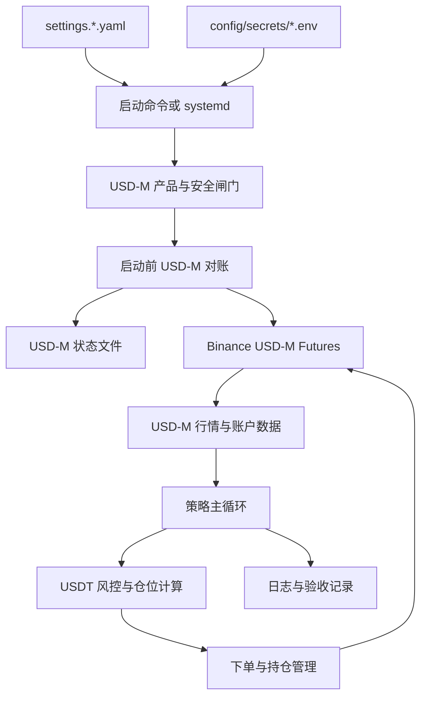

# 滚仓系统实现的 Plan 文档 3.0 版本

> 本文档用于在现有 2.0 系统已经完成所有实现阶段与验收的基础上，继续实施 3.0：将当前 Binance COIN-M 币本位合约系统重构为 Binance USD-M / U 本位 USDT 永续合约系统。本文档只描述计划、验收方式、Cursor 分阶段 prompts 和系统使用方法，不包含代码。

## 1. 3.0 背景与边界

当前 2.0 系统已经具备以下能力：

- 支持 dry-run 策略循环，不向交易所发 signed 订单。
- 支持 Binance COIN-M Futures Testnet 与 live signed 自动交易流程。
- 支持趋势模型离线验收、回测、参数校准、状态对账、单标的交易锁和异常 halt。
- 支持 Testnet / live 配置、密钥、状态文件隔离。
- 支持 Ubuntu 云服务器 SSH 运维、`systemd` 托管、上线验收文档和应急手册。

3.0 的目标不是重写交易策略，也不是推翻 2.0 的运行框架，而是把交易产品线从 **币本位 COIN-M Futures** 迁移为 **U 本位 USD-M USDT 永续合约**。完成后，系统当前标准应变为 USD-M；1.0 和 2.0 中所有 COIN-M 内容仅作为历史版本参考。

3.0 的边界如下：

- 必须把代码、配置、README、验收文档、验收脚本和部署说明中的币本位合约语义更新为 U 本位合约语义。
- 必须完成全项目检查，确认不再存在会误导当前使用者的 COIN-M / 币本位 / `/dapi` / `dapi.binance.com` / `DOGEUSD_PERP` 等旧语义。
- 保留趋势模型、单标的交易锁、dry-run / testnet / live 三层运行方式、密钥文件方案、状态对账、异常 halt、`systemd` 运维框架。
- 根据 USD-M 与 COIN-M 的差异，合理调整 API、symbol、数量、名义价值、保证金、权益、仓位和回测计量细节。
- U 本位永续合约以 USDT 保证金为核心，保证金逻辑比币本位更直接；系统中所有“币余额乘价格折算权益”的逻辑必须替换为 USDT 账户权益逻辑。
- 3.0 完成后仍不承诺盈利；目标是让系统可以清晰、安全、可验收地自动化交易 USD-M USDT 永续合约。

## 2. 3.0 总目标

3.0 完成后，系统应满足：

1. 默认交易产品为 Binance USD-M Futures USDT 永续合约。
2. Public 与 signed API 使用 USD-M 路径：Testnet 使用 `https://testnet.binancefuture.com` + `/fapi/v1`，live 使用 `https://fapi.binance.com` + `/fapi/v1`。
3. 候选资产通过 USD-M `exchangeInfo` 动态映射到可交易 symbol，例如 `DOGEUSDT`、`AVAXUSDT`、`BTCUSDT`，不得硬编码某个标的一定可交易。
4. 账户权益、可用保证金、未实现盈亏、手续费、仓位名义价值均按 USDT 线性永续合约计量。
5. 下单数量按 USD-M quantity 规则处理，即 base asset 数量，而不是 COIN-M 合约张数。
6. 单标的交易锁、状态恢复、对账、异常 halt 和禁止多 live 进程的机制继续有效。
7. Testnet 与 live 仍严格隔离，且 USD-M 版本不得复用旧 COIN-M 状态文件。
8. live 自动交易仍由多重显式安全闸门控制，默认关闭。
9. 代码和文档中旧的 COIN-M 语义完成清理，当前用户不会被引导去币本位板块操作。
10. 用户可以按 3.0 文档完成 dry-run、USD-M Testnet 自动交易、USD-M live 小资金试运行、`systemd` 常驻运行、停止、对账和手动撤单平仓。

## 3. COIN-M 到 USD-M 的核心差异

| 维度 | 2.0 COIN-M 币本位 | 3.0 USD-M / U 本位目标 |
| --- | --- | --- |
| 产品线 | Binance COIN-M Futures | Binance USD-M Futures |
| 保证金币种 | 标的币或币本位保证金资产 | USDT 为主 |
| live REST base | `https://dapi.binance.com` | `https://fapi.binance.com` |
| REST path prefix | `/dapi/v1` | `/fapi/v1` |
| Testnet host | `https://testnet.binancefuture.com` | `https://testnet.binancefuture.com` |
| Testnet path | `/dapi/v1` | `/fapi/v1` |
| symbol 示例 | `DOGEUSD_PERP`、`BTCUSD_PERP` | `DOGEUSDT`、`BTCUSDT` |
| quantity 含义 | 合约张数 | base asset 数量 |
| 名义价值 | 受合约面值与反向合约规则影响 | 近似 `price * quantity`，以 USDT 计 |
| 权益估算 | 币余额乘价格折算 | 直接读取 USDT 钱包、可用余额和未实现盈亏 |
| 用户网页操作 | 币本位合约 / COIN-M | U 本位合约 / USD-M |

### 3.1 API 差异

USD-M 与 COIN-M 的 endpoint 名称相似，但不能只替换域名。3.0 必须逐项验收：

- `GET /fapi/v1/ping`
- `GET /fapi/v1/time`
- `GET /fapi/v1/exchangeInfo`
- `GET /fapi/v1/klines`
- `GET /fapi/v1/ticker/price`
- `GET /fapi/v2/account` 或当前 Binance USD-M 文档推荐的账户接口
- `GET /fapi/v2/positionRisk` 或当前 Binance USD-M 文档推荐的持仓风险接口
- `POST /fapi/v1/leverage`
- `POST /fapi/v1/order`
- `GET /fapi/v1/order`
- `DELETE /fapi/v1/order`
- `GET /fapi/v1/openOrders`

实现时必须以 Binance 官方 USD-M Futures 文档和实际 Testnet 响应为准。若某些账户或持仓 endpoint 推荐版本发生变化，应选择当前官方推荐版本，并在 README 中写清。

### 3.2 Symbol 差异

配置层仍使用人类可读资产代码：

```text
DOGE, AVAX, BTC, SHIB, WIF, PEPE, TON, HYPE
```

运行时通过 USD-M `exchangeInfo` 动态筛选 symbol：

- `contractType` 应优先选择 `PERPETUAL`。
- `status` 应为 `TRADING`。
- `quoteAsset` 应为 `USDT`，除非后续明确支持 BUSD 或其它报价资产。
- `marginAsset` 应为 `USDT`。
- `baseAsset` 与候选资产匹配；对 `1000SHIB`、`1000PEPE` 等特殊命名不得猜测，必须以交易所返回为准。
- 至少得到配置要求的可监测标的数量，否则不得进入自动交易循环。

### 3.3 保证金与权益差异

币本位系统中可能存在以下逻辑：

```text
权益约等于 margin_asset_wallet_balance * mark_price
```

3.0 必须替换为 U 本位逻辑：

```text
equity_usdt = USDT wallet balance + USDT unrealized profit
available_margin_usdt = USD-M account availableBalance
position_notional_usdt = abs(position quantity * mark price)
```

具体字段名称以 Binance USD-M 实际账户接口响应为准。系统不得再通过“币余额乘价格”估算风险预算。

### 3.4 数量、名义价值与 PnL 差异

USD-M 永续是线性合约。策略和风控中应统一使用：

```text
notional_usdt = abs(quantity_base * entry_price_usdt)
pnl_usdt_long = quantity_base * (exit_price - entry_price)
pnl_usdt_short = quantity_base * (entry_price - exit_price)
```

这比币本位反向合约更直观，但也意味着所有仓位计算、回测、手续费、滑点和最小名义价值校验都必须重新验收。

## 4. 3.0 架构与数据流

3.0 继续保留 2.0 的三层运行方式：

| 层级 | 用途 | 是否下真实资金订单 |
| --- | --- | --- |
| dry-run | 读取 USD-M 行情、计算信号、输出决策，不下单 | 否 |
| testnet | Binance USD-M Futures Testnet signed 自动交易 | 否，Testnet 资金 |
| live | Binance USD-M Futures live signed 自动交易 | 是 |

建议数据流如下：



### 4.1 允许保留的系统框架

以下框架不需要大改：

- 趋势评分模型。
- 多候选标的扫描。
- 任一时刻最多交易一个标的。
- `IDLE`、`ENTERING`、`IN_POSITION`、`EXITING`、`COOLDOWN` 状态机。
- 启动前对账，以交易所真实持仓和挂单为准恢复。
- 异常时 halt 或 pause，不盲目继续开新仓。
- Testnet 先验收，再进入 live。
- live 初期小资金、单轮 `--once --no-dry-run`，再考虑 `systemd` 常驻。

### 4.2 必须更新的交易所产品层

必须更新或抽象以下产品层概念：

- `coin_m_prefix` 改为 `usd_m_prefix` 或更通用的 `api_prefix`。
- `CoinMFuturesSymbol` 改为 `UsdMFuturesSymbol` 或通用 `FuturesSymbolSpec`。
- `BinanceCoinMClient` / `BinanceCoinMSignedClient` 改为 USD-M 客户端或产品可配置客户端。
- `coinm-signed-smoke` 改为 `usdm-signed-smoke` 或改造成 `futures-signed-smoke --product usdm`。
- `reconcile_coin_m_account` 改为 USD-M 对账逻辑或通用对账逻辑。
- 日志、命令输出、异常信息不得继续提示用户去 COIN-M 板块处理 USD-M 交易。

## 5. 配置、密钥、状态文件规划

3.0 推荐保持 Testnet 和 live 分离：

```text
config/
  settings.testnet.example.yaml
  settings.live.example.yaml
  settings.live.minimal-funds.example.yaml
  secrets/
    testnet.env
    live.env
data/
  roll_state_testnet.json
  roll_state_live.json
```

### 5.1 Testnet 配置目标

```yaml
environment: testnet

binance:
  product: "usdm"
  rest_base: "https://testnet.binancefuture.com"
  api_prefix: "/fapi/v1"
  recv_window_ms: 5000

secrets:
  file: "./config/secrets/testnet.env"

state:
  backend: json
  path: "./data/roll_state_testnet.json"

strategy:
  testnet_signed_orders_enabled: true
  live_trading_enabled: false
  loop_interval_sec: 120
  initial_leverage: 25
```

### 5.2 live 配置目标

```yaml
environment: live

binance:
  product: "usdm"
  rest_base: "https://fapi.binance.com"
  api_prefix: "/fapi/v1"
  recv_window_ms: 5000

secrets:
  file: "./config/secrets/live.env"

state:
  backend: json
  path: "./data/roll_state_live.json"

strategy:
  testnet_signed_orders_enabled: false
  live_trading_enabled: true
  loop_interval_sec: 120
```

### 5.3 密钥要求

- Testnet 与 live 必须使用不同 API Key。
- live API Key 必须禁用提现权限。
- live API Key 建议开启 IP 白名单，只允许云服务器公网 IP 使用。
- API Key 必须具备 USD-M Futures 相关权限；不得误用只适用于 COIN-M 的旧说明。
- `config/secrets/` 必须继续被 Git 忽略。
- 日志、异常、测试输出不得打印 Secret。

### 5.4 状态文件要求

3.0 可以继续使用 `data/roll_state_testnet.json` 和 `data/roll_state_live.json`，但迁移时必须注意：

- 如果旧状态文件中保存的是 COIN-M symbol，例如 `DOGEUSD_PERP`，不得直接作为 USD-M 状态恢复。
- 首次升级到 3.0 前，应停止旧 COIN-M 进程，确认 COIN-M 无持仓无挂单，再启动 USD-M 对账。
- 如需保留历史，可将旧状态文件归档为 `roll_state_coinm_*.json`，但当前运行状态必须来自 USD-M 对账。
- 对账输出必须明确 `product=usdm`、`environment`、`rest_base`、持仓 symbols、挂单 symbols 和 halt 原因。

## 6. USD-M API 与 symbol 迁移要求

### 6.1 Public API

Public API 必须完成以下能力：

| 能力 | USD-M 验收点 |
| --- | --- |
| 连通性 | `GET /fapi/v1/ping` 成功 |
| 时间同步 | `GET /fapi/v1/time` 成功，并计算本地时间偏移 |
| 合约发现 | `GET /fapi/v1/exchangeInfo` 能解析 USDT 永续合约规则 |
| K 线数据 | `GET /fapi/v1/klines` 能获取 `15m`、`1h`、`4h` |
| 最新价格 | `GET /fapi/v1/ticker/price` 或等价接口可用 |
| 候选筛选 | 人类资产代码能映射到 USD-M 可交易 symbol |

### 6.2 Signed API

Signed API 必须完成以下能力：

| 能力 | USD-M 验收点 |
| --- | --- |
| 账户信息 | 能读取 USDT 钱包余额、可用余额、未实现盈亏 |
| 持仓查询 | 能识别所有非零 USD-M 持仓 |
| 未完成订单 | 能识别所有 USD-M 未完成委托 |
| 杠杆设置 | 能对目标 USD-M symbol 设置 leverage |
| 下单 | 能在 Testnet 创建最小可交易订单 |
| 查询订单 | 能查询订单状态 |
| 撤单 | 能撤销未成交订单 |
| 平仓 | 能使用 reduce-only、close position 或等价安全方式关闭持仓 |
| 对账 | 能确认无持仓、无挂单，或进入 halt |

### 6.3 交易规则解析

必须从 USD-M `exchangeInfo` 解析：

- `symbol`
- `baseAsset`
- `quoteAsset`
- `marginAsset`
- `contractType`
- `status`
- `pricePrecision` 或价格过滤器
- `quantityPrecision` 或数量过滤器
- `PRICE_FILTER`
- `LOT_SIZE`
- `MARKET_LOT_SIZE`
- `MIN_NOTIONAL` 或 USD-M 当前返回的最小名义价值规则
- 最大杠杆相关信息，如 Binance 响应中可直接获得或需通过其它接口获得

任何下单前都必须校验价格、数量、最小名义价值、步长、可用保证金、当前持仓和未完成订单。

## 7. U 本位保证金、权益、仓位与风控改造

### 7.1 权益读取

3.0 中风控预算应优先使用 USDT 账户数据：

```text
account_equity_usdt = total wallet balance + unrealized profit
available_margin_usdt = available balance
```

实现时可按 Binance USD-M 实际字段命名落地，例如 `totalWalletBalance`、`totalUnrealizedProfit`、`availableBalance`，但必须通过 Testnet 和 live 只读对账验收字段含义。

### 7.2 仓位数量

USD-M 下单 quantity 是 base asset 数量。仓位计算建议使用：

```text
risk_amount_usdt = account_equity_usdt * max_trade_risk_fraction
stop_distance_usdt = abs(entry_price - stop_price)
raw_quantity_base = risk_amount_usdt / stop_distance_usdt
notional_usdt = raw_quantity_base * entry_price
```

随后再应用：

- Kelly 上限。
- 最大仓位比例。
- `LOT_SIZE` / `MARKET_LOT_SIZE` 步长。
- `MIN_NOTIONAL`。
- 最大杠杆与可用保证金。
- 单标的交易锁。

### 7.3 杠杆与保证金

U 本位保证金逻辑比币本位简单，但不能因此放松风控：

- 初始杠杆仍可保留 25x 作为上限，不代表必须用满可用保证金。
- 实际仓位必须由止损距离反推最大可亏损，而不是由最大可开数量反推。
- 随盈利降低杠杆时，应结合部分平仓、减少后续加仓规模、抬高追踪止损，而不是误以为修改 leverage 会自动降低已有仓位风险。
- 逐仓 / 全仓模式必须在文档和配置中明确。若系统未主动设置 margin type，应在使用文档中要求用户确认交易所账户模式。
- 双向持仓模式 / 单向持仓模式必须在验收中确认。若系统目标是单向净持仓，应明确拒绝 hedge 模式下的异常双腿状态。

### 7.4 回测和参数重校准

迁移到 USD-M 后，不应直接沿用 COIN-M 回测结果。至少应重新校准：

- `kelly_p`
- `kelly_b`
- `kelly_multiplier`
- `max_position_fraction`
- `stop_adverse_fraction`
- `trail_stop_fraction`
- 手续费率
- 滑点假设
- 最小名义价值与小币种最小数量影响

回测 PnL 应使用 USDT 线性合约公式，不再使用 COIN-M 合约面值或反向合约近似。

## 8. 交易策略与流程需调整的细节

### 8.1 可保持不变的策略部分

以下部分可以保持 2.0 逻辑：

- 多周期趋势评分：`15m`、`1h`、`4h`。
- 对数价格回归斜率、R²、ADX、EMA、Donchian、震荡过滤、成交量确认。
- `long`、`short`、`no_trade` 三类信号。
- 信号解释与拒绝原因输出。
- 多标的扫描但单标的交易。
- 固定止损、ATR 止损、追踪止损、趋势反转退出、账户级熔断。

### 8.2 必须调整的策略细节

以下细节必须为 USD-M 重新验收：

- 标的池：USD-M 支持的 symbol 与 COIN-M 不同，候选资产需重新确认。
- K 线来源：回测和 dry-run 应使用 USD-M `/fapi/v1/klines`。
- 成交量含义：USD-M 返回的 volume 字段需确认是 base volume 还是 quote volume，信号解释应保持一致。
- 止损距离：不同合约流动性、最小 tick 和滑点会影响止损参数。
- 加仓逻辑：浮盈再投入以 USDT 权益和当前未实现盈亏为准。
- 资金费率：若系统纳入持仓成本，应使用 USD-M 对应资金费率数据。
- 手续费：按 USD-M 手续费计价和 VIP 等级重新配置。

### 8.3 自动交易流程

USD-M signed 自动交易流程建议保持：

1. 加载配置和密钥。
2. 校验 `product=usdm`、`environment`、`rest_base`、`api_prefix`、live 安全开关。
3. 获取服务器时间并校准 timestamp。
4. 执行 USD-M 对账，确认当前持仓、挂单与本地状态一致。
5. 若无持仓，扫描候选 symbol，计算趋势评分。
6. 通过风控后选择最多一个 symbol。
7. 设置杠杆。
8. 按 USDT 风险预算计算 quantity。
9. 下单并确认订单状态。
10. 建立或管理止损 / 追踪止损。
11. 持仓期间拒绝其它 symbol 开仓。
12. 达到退出条件后平仓。
13. 平仓后进入冷却期。

## 9. 全项目代码与文档同步更新范围

3.0 虽然只要求生成本计划文档，但后续实施时必须把下面范围作为检查清单。实现完成后应使用搜索工具确认旧语义已经清理。

### 9.1 核心代码

必须检查并改造：

- `src/roll/binance_client.py`
- `src/roll/signed_guard.py`
- `src/roll/coinm_auto_trade.py`
- `src/roll/coinm_signed_testnet.py`
- `src/roll/strategy_loop.py`
- `src/roll/position_manager.py`
- `src/roll/risk.py`
- `src/roll/backtest.py`
- `src/roll/offline_trend.py`
- `src/roll/market_data.py`
- `src/main.py`

重点清理：

- `CoinM`、`coin_m`、`COIN-M`、`币本位`
- `/dapi`
- `dapi.binance.com`
- `DOGEUSD_PERP`、`BTCUSD_PERP`
- 合约张数、`contractSize` 被误用于 USD-M quantity 的逻辑
- 币余额乘价格折算权益的逻辑

### 9.2 测试

必须新增或更新：

- `tests/test_binance_client.py`
- `tests/test_symbol_filter.py`
- `tests/test_signed_guard.py`
- `tests/test_strategy_loop.py`
- `tests/test_position_manager.py`
- `tests/test_risk.py`
- `tests/test_acceptance_scripts.py`

测试应覆盖：

- USD-M host 和 `/fapi/v1` 守卫。
- `DOGEUSDT` 等 symbol 解析。
- USDT 权益读取。
- USD-M quantity 与最小名义价值校验。
- Testnet 与 live 安全开关。
- 对账发现多持仓、跨标的挂单时 halt。

### 9.3 配置

必须更新：

- `config/settings.example.yaml`
- `config/settings.testnet.example.yaml`
- `config/settings.live.example.yaml`
- `config/settings.live.minimal-funds.example.yaml`
- `config/env.example`
- `config/secrets/*.env.example`

配置中应避免继续使用 `coin_m_prefix`。如果保留兼容字段，也必须在文档中标明不再是当前推荐。

### 9.4 文档

必须更新：

- `README.md`
- `docs/live-go-live-acceptance.md`
- `docs/checklists/live-go-live-checklist.md`
- `docs/templates/live-acceptance-record.template.md`
- `scripts/acceptance/README.md`
- `deploy/systemd/README.md`
- `docs/滚仓系统实现的plan文档.md`
- `docs/滚仓系统实现的plan文档2.0版本.md`

1.0 和 2.0 plan 可以保留历史内容，但必须在 README 或当前入口文档中明确：当前实现标准为 3.0 USD-M。

### 9.5 验收脚本与部署资产

必须更新：

- `scripts/acceptance/preflight.sh`
- `scripts/acceptance/phase1-testnet-closed-loop.sh`
- `scripts/acceptance/phase2-live-dry-run.sh`
- `scripts/acceptance/phase3-live-reconcile.sh`
- `scripts/acceptance/phase4-live-first-signed-once.sh`
- `scripts/acceptance/collect-session.sh`
- `deploy/systemd/roll-testnet.service`
- `deploy/systemd/roll-live.service`

脚本输出不得继续提示“去 COIN-M 网页确认”。应改为 U 本位合约 / USD-M Futures。

## 10. Cursor 分阶段 Prompts 与验收

下面 prompts 可按顺序复制给 Cursor 执行。每个 prompt 完成后，都要求 Cursor 汇报“本阶段实现了什么”和“如何验收”。所有涉及终端命令的阶段，在执行命令前都必须先执行 `conda activate roll-env`。

### Prompt 1：全项目 COIN-M 语义盘点与迁移清单

```text
请只读扫描当前仓库，为 3.0 的 USD-M/U 本位迁移建立详细清单，暂时不要修改任何文件。

目标：将当前 Binance COIN-M 币本位系统迁移到 Binance USD-M / U 本位 USDT 永续合约。

要求：
1. 搜索所有 COIN-M、coin_m、CoinM、币本位、/dapi、dapi.binance.com、DOGEUSD_PERP、BTCUSD_PERP、contractSize、合约张数等旧语义。
2. 按代码、测试、配置、文档、验收脚本、systemd 部署资产分类列出需要修改的文件。
3. 标出每个文件中旧语义的类型：API host/path、symbol、账户权益、下单数量、保证金、文档说明、验收提示。
4. 判断哪些地方可以直接替换为 USD-M，哪些地方必须重新设计或重新验收。
5. 不要写代码，不要改文件。
6. 所有终端命令执行前必须先执行 conda activate roll-env。

完成后告诉我：发现了哪些迁移点、风险最高的 5 个位置是什么、下一阶段建议先改哪些文件。
```

验收：

- 输出完整迁移清单。
- 明确核心风险：API、symbol、USDT 权益、quantity、最小名义价值、文档误导。
- 没有修改任何文件。

### Prompt 2：配置与产品抽象改造

```text
请实施 3.0 的配置与产品抽象改造，将系统当前交易产品切换为 Binance USD-M / U 本位永续合约。

要求：
1. 配置中引入 product=usdm 或等价字段。
2. 将 API prefix 从 coin_m_prefix / /dapi/v1 改为 usd_m_prefix 或通用 api_prefix=/fapi/v1。
3. Testnet 配置使用 https://testnet.binancefuture.com + /fapi/v1。
4. live 配置使用 https://fapi.binance.com + /fapi/v1。
5. Testnet/live 的 secrets.file 和 state.path 继续隔离。
6. live_trading_enabled 默认仍为 false，示例中必须明确只有审查后才能开启。
7. 更新配置示例、配置读取、测试和 README 中对应说明。
8. 不要接入真实下单。
9. 所有终端命令执行前必须先执行 conda activate roll-env。

完成后告诉我：配置字段如何变化、Testnet/live 如何隔离、如何验收不会再误用 dapi。
```

验收：

- `config/settings.testnet.example.yaml` 指向 Testnet + `/fapi/v1`。
- `config/settings.live.example.yaml` 指向 `https://fapi.binance.com` + `/fapi/v1`。
- 旧 `coin_m_prefix` 不再是当前推荐路径。
- 相关配置测试通过。

### Prompt 3：USD-M Public API 客户端与 symbol 筛选

```text
请实现或重构 Binance USD-M Futures Public API 客户端。

要求：
1. 支持 ping、time、exchangeInfo、klines、ticker price。
2. 使用 /fapi/v1 路径。
3. 从 USD-M exchangeInfo 解析 symbol、baseAsset、quoteAsset、marginAsset、contractType、status、价格精度、数量精度、LOT_SIZE、MARKET_LOT_SIZE、MIN_NOTIONAL。
4. 候选资产映射到 USDT 永续 symbol，例如 DOGE -> DOGEUSDT，但不得硬编码，必须以 exchangeInfo 为准。
5. 只保留 quoteAsset=USDT、marginAsset=USDT、contractType=PERPETUAL、status=TRADING 的合约。
6. 至少得到配置要求的可监测标的数量，否则给出清晰错误。
7. 更新离线趋势、symbol-availability、回测的 public 行情来源。
8. 所有终端命令执行前必须先执行 conda activate roll-env。

完成后告诉我：实现了哪些 USD-M public API、候选资产映射结果是什么、如何用 Testnet 或 public live 行情验收。
```

验收：

- `ping`、`time`、`exchangeInfo` 成功。
- 可拉取 `DOGEUSDT` 或其它可用 USDT 永续 K 线。
- 候选池能输出至少 3 个可监测 USD-M symbol，或清晰说明不足原因。
- 单元测试覆盖 USD-M symbol 解析和过滤器解析。

### Prompt 4：USD-M Signed API、安全闸门与对账

```text
请实现 Binance USD-M Futures signed API、安全闸门和对账能力。

要求：
1. signed 请求使用 /fapi 路径和 HMAC SHA256 签名。
2. environment=testnet 时只允许 https://testnet.binancefuture.com + /fapi。
3. environment=live 时只允许 https://fapi.binance.com + /fapi。
4. Testnet signed 必须同时满足 strategy.testnet_signed_orders_enabled=true。
5. live signed 必须同时满足 strategy.live_trading_enabled=true。
6. 支持账户信息、持仓查询、未完成订单查询、设置杠杆、创建订单、查询订单、撤单、平仓。
7. reconcile-state 必须支持 USD-M Testnet 和 live，只读对账不下单。
8. 对账发现多标的持仓、跨标的挂单或状态异常时必须 halt 自动交易。
9. 日志和异常不得打印 API Secret。
10. 所有终端命令执行前必须先执行 conda activate roll-env。

完成后告诉我：USD-M signed 放行条件是什么、对账输出包含哪些字段、如何验收 live 默认不会误下单。
```

验收：

- Testnet signed smoke 能读取账户和持仓。
- live 在 `live_trading_enabled=false` 时拒绝 signed 自动交易。
- live host 不是 `https://fapi.binance.com` 时拒绝 signed 自动交易。
- `reconcile-state` 输出 `product=usdm`、持仓 symbols、挂单 symbols、halt 状态。
- Secret 不出现在日志、异常和测试输出中。

### Prompt 5：USDT 权益、仓位、风控与回测计量

```text
请把系统的权益、仓位、风险和回测计量改为 USD-M / U 本位 USDT 线性永续逻辑。

要求：
1. 不再使用“币余额 * 标记价”估算账户权益。
2. 从 USD-M account 响应读取 USDT wallet balance、available balance、unrealized profit 或官方等价字段。
3. 下单 quantity 按 base asset 数量计算，不再按 COIN-M 合约张数。
4. 名义价值使用 notional_usdt = abs(quantity * price)。
5. PnL 使用 USDT 线性公式：多头 qty*(exit-entry)，空头 qty*(entry-exit)。
6. 下单前校验 LOT_SIZE、MARKET_LOT_SIZE、MIN_NOTIONAL、最大仓位比例、最大单笔风险、可用保证金。
7. Kelly、止损、追踪止损和加仓逻辑继续保留，但参数需要重新验收。
8. 更新回测逻辑和相关测试。
9. 所有终端命令执行前必须先执行 conda activate roll-env。

完成后告诉我：USDT 权益如何计算、quantity 如何生成、哪些风控参数需要重新校准、如何验收不会超风险开仓。
```

验收：

- USDT 权益字段有单元测试。
- 负 Kelly 不开仓。
- 数量按 USD-M step size 向下取整。
- 低于最小名义价值时拒绝下单或给出清晰原因。
- 回测 PnL 使用 USDT 线性公式。

### Prompt 6：USD-M Testnet 自动交易闭环

```text
请把策略主循环接入 Binance USD-M Futures Testnet 自动交易闭环。

要求：
1. 只允许 Testnet。
2. 使用 /fapi 路径。
3. 信号触发后自动设置杠杆、计算 USDT 风险预算、生成 USD-M quantity、下单、管理止损、监控持仓、平仓。
4. 严格遵守单标的交易锁。
5. 持仓期间其它 symbol 信号只记录，不下单。
6. 异常时停止开新仓，并尽可能保护已有持仓。
7. 下单验收必须使用最小可交易数量或极小风险配置。
8. 所有终端命令执行前必须先执行 conda activate roll-env。

完成后告诉我：Testnet 自动交易闭环实现了什么、开仓和平仓是否成功、如何确认没有 COIN-M 路径残留。
```

验收：

- USD-M Testnet 完成一次开仓、查询持仓、平仓、确认无持仓闭环。
- 持仓期间不会交易第二个 symbol。
- 止损或退出条件能触发平仓。
- 对账输出与 Binance USD-M Testnet 网页一致。

### Prompt 7：USD-M live 自动交易、小资金试运行与 systemd

```text
请在 USD-M Testnet 闭环验收通过后，实现 USD-M live 自动交易路径与 systemd 部署更新。

要求：
1. live signed 只允许 https://fapi.binance.com + /fapi。
2. live 必须满足 environment=live、product=usdm、live_trading_enabled=true、--no-dry-run、live secrets、live state、启动前对账。
3. 首次 live 只建议 --once --no-dry-run，小资金、最小可交易数量或极低风险配置。
4. systemd 的 roll-live.service 必须使用 live 配置、live 密钥、live 状态文件。
5. live 默认不要 enable 开机自启。
6. 禁止同时运行多个 live 自动交易进程。
7. 异常时 halt 或 pause，不得继续盲目开新仓。
8. 所有终端命令执行前必须先执行 conda activate roll-env，systemd 内部必须等价使用 roll-env 的 Python。

完成后告诉我：live 启用条件是什么、systemd 文件如何更新、首次小资金试运行如何验收。
```

验收：

- live 配置在任一安全条件缺失时拒绝 signed 自动交易。
- `--once --no-dry-run` 可在小资金条件下执行一轮并输出清晰日志。
- `sudo systemctl start roll-live` 使用 USD-M live 配置。
- `journalctl -u roll-live -f` 可查看日志。
- 停止后对账与 Binance USD-M live 网页一致。

### Prompt 8：全项目文档、验收脚本和旧语义清理

```text
请同步更新全项目文档、验收脚本和部署说明，使当前系统标准明确为 Binance USD-M / U 本位 USDT 永续合约。

要求：
1. 更新 README.md。
2. 更新 docs/live-go-live-acceptance.md。
3. 更新 docs/checklists/live-go-live-checklist.md。
4. 更新 docs/templates/live-acceptance-record.template.md。
5. 更新 scripts/acceptance/README.md 与 scripts/acceptance/*.sh。
6. 更新 deploy/systemd/README.md。
7. 1.0 和 2.0 plan 可以保留历史内容，但当前入口文档必须说明 3.0 USD-M 是当前标准。
8. 文档中的网页操作必须改为 U 本位合约 / USD-M Futures，不得继续指向 COIN-M。
9. 搜索确认 COIN-M、币本位、/dapi、dapi.binance.com、DOGEUSD_PERP 等旧语义没有残留在当前使用路径中；历史文档如保留，必须标注历史。
10. 所有终端命令执行前必须先执行 conda activate roll-env。

完成后告诉我：更新了哪些文档、哪些旧语义已清理、用户现在如何按文档运行 USD-M 系统。
```

验收：

- README 当前入口指向 USD-M。
- 验收脚本不再断言 `dapi.binance.com`。
- 文档不再要求用户去 COIN-M 网页处理当前系统持仓。
- 搜索结果中旧 COIN-M 语义只存在于明确标注为历史的文档中。

### Prompt 9：最终验收、回归测试与高可用检查

```text
请对 3.0 USD-M 迁移做最终验收、回归测试和高可用检查。

要求：
1. 运行完整测试套件。
2. 运行 USD-M public API smoke。
3. 运行 USD-M Testnet signed smoke。
4. 完成一次 USD-M Testnet 自动交易闭环。
5. 完成 live dry-run 使用实盘 public 行情连续观察，建议至少 24 小时。
6. 完成 live 对账，确认无非预期持仓和挂单。
7. 首次 live signed 只执行 --once --no-dry-run，并使用极小资金。
8. 检查日志、状态文件、密钥读取、进程锁、systemd 和应急流程。
9. 搜索确认旧 COIN-M 当前路径没有残留。
10. 所有终端命令执行前必须先执行 conda activate roll-env。

完成后告诉我：3.0 最终通过了哪些验收、还剩哪些人工风险确认项、是否可以进入持续小资金试运行。
```

验收：

- 测试通过。
- USD-M Testnet 闭环通过。
- live 对账通过。
- live 首次 signed 运行有完整记录。
- 无当前路径 COIN-M 残留。
- 用户知道如何停止、对账、手动撤单和平仓。

## 11. 3.0 完成后的系统使用方法

下文描述的是 3.0 实现完成后的目标使用方法。所有命令默认在仓库根目录执行，且每次运行 Python 命令前都必须先执行：

```bash
conda activate roll-env
```

### 11.1 准备配置和密钥

复制配置：

```bash
conda activate roll-env
cp config/settings.testnet.example.yaml config/settings.testnet.yaml
cp config/settings.live.example.yaml config/settings.live.yaml
```

Windows PowerShell：

```powershell
conda activate roll-env
Copy-Item config\settings.testnet.example.yaml config\settings.testnet.yaml
Copy-Item config\settings.live.example.yaml config\settings.live.yaml
```

准备密钥文件：

```bash
conda activate roll-env
mkdir -p config/secrets
chmod 700 config/secrets
cp config/secrets/testnet.env.example config/secrets/testnet.env
cp config/secrets/live.env.example config/secrets/live.env
chmod 600 config/secrets/testnet.env
chmod 600 config/secrets/live.env
```

密钥文件格式：

```text
BINANCE_API_KEY=你的_key
BINANCE_API_SECRET=你的_secret
```

Testnet Key 应来自 Binance Futures Testnet，并能访问 USD-M Futures Testnet。live Key 应来自 Binance 实盘账户，具备 USD-M Futures 权限，禁止提现，建议配置 IP 白名单。

### 11.2 dry-run

dry-run 不发 signed 订单，用于确认 USD-M 行情、symbol 筛选、趋势评分、风控拒绝原因和日志。

单轮：

```bash
conda activate roll-env
python -m main run-loop --config config/settings.testnet.yaml --once
```

持续：

```bash
conda activate roll-env
python -m main run-loop --config config/settings.testnet.yaml
```

预期：

- 输出 USD-M symbol，例如 `DOGEUSDT`。
- 输出候选标的评分排序。
- 没有信号时输出 `no_trade` 原因。
- 不创建订单。

### 11.3 USD-M Testnet 自动交易

启动前先对账：

```bash
conda activate roll-env
python -m main reconcile-state --config config/settings.testnet.yaml --secrets-file config/secrets/testnet.env
```

确认：

- `product=usdm`
- `environment=testnet`
- `nonzero_position_symbols=[]` 或只存在系统允许管理的单一持仓
- `symbols_with_open_orders=[]` 或只存在系统允许管理的订单
- `halt_automatic_trading=False`

单轮自动交易：

```bash
conda activate roll-env
python -m main run-loop --config config/settings.testnet.yaml --secrets-file config/secrets/testnet.env --once --no-dry-run
```

持续自动交易：

```bash
conda activate roll-env
python -m main run-loop --config config/settings.testnet.yaml --secrets-file config/secrets/testnet.env --no-dry-run
```

停止前台进程：

```text
Ctrl+C
```

停止后必须再次对账：

```bash
conda activate roll-env
python -m main reconcile-state --config config/settings.testnet.yaml --secrets-file config/secrets/testnet.env
```

同时登录 Binance Futures Testnet 的 USD-M / U 本位合约页面，确认仓位和挂单与对账输出一致。

### 11.4 USD-M live 实盘自动交易

live 只能在以下条件全部满足后使用：

- USD-M Testnet 已完成至少一次自动开仓、持仓管理、平仓闭环。
- live dry-run 使用实盘 public 行情观察至少 24 小时。
- live API Key 禁止提现并建议启用 IP 白名单。
- `config/settings.live.yaml` 使用 `environment: live`、`product: usdm`、`https://fapi.binance.com`、`/fapi/v1`。
- `strategy.live_trading_enabled: true` 经过人工审查后才开启。
- live 对账通过。
- 明确知道如何停止进程、网页撤单和平仓。

live 对账：

```bash
conda activate roll-env
python -m main reconcile-state --config config/settings.live.yaml --secrets-file config/secrets/live.env
```

首次 live 单轮：

```bash
conda activate roll-env
python -m main run-loop --config config/settings.live.yaml --secrets-file config/secrets/live.env --once --no-dry-run
```

确认行为符合预期后，再考虑持续运行：

```bash
conda activate roll-env
python -m main run-loop --config config/settings.live.yaml --secrets-file config/secrets/live.env --no-dry-run
```

live 初期必须使用极小资金和保守参数，能够接受全部损失。首次 live 不建议直接交给 `systemd` 常驻，应先前台单轮观察。

### 11.5 systemd 托管

安装或更新服务后：

```bash
sudo systemctl daemon-reload
```

启动 Testnet：

```bash
sudo systemctl start roll-testnet
sudo systemctl status roll-testnet
```

启动 live：

```bash
sudo systemctl start roll-live
sudo systemctl status roll-live
```

查看日志：

```bash
journalctl -u roll-live -n 200 --no-pager
journalctl -u roll-live -f
```

停止 live：

```bash
sudo systemctl stop roll-live
sudo systemctl status roll-live
```

停止后必须对账：

```bash
conda activate roll-env
python -m main reconcile-state --config config/settings.live.yaml --secrets-file config/secrets/live.env
```

live 服务默认不应开机自启。只有在小资金连续运行稳定、已接受服务器重启后自动恢复策略的风险时，才考虑：

```bash
sudo systemctl enable roll-live
```

### 11.6 确认无持仓、无挂单

命令行对账：

```bash
conda activate roll-env
python -m main reconcile-state --config config/settings.live.yaml --secrets-file config/secrets/live.env
```

安全值：

| 输出字段 | 安全值 |
| --- | --- |
| `nonzero_position_symbols` | `[]` |
| `symbols_with_open_orders` | `[]` |
| `halt_automatic_trading` | `False` |
| `halt_reason` | `None` 或空 |

网页复核：

- Testnet：登录 Binance Futures Testnet，进入 USD-M / U 本位合约页面。
- live：登录 Binance 实盘账户，进入衍生品中的 U 本位合约 / USD-M Futures 页面。
- 确认仓位为 0，当前委托为空。

命令行和网页不一致时，以交易所网页和官方账户状态为准处理风险，处理完再重新对账。

### 11.7 手动撤单和平仓

应急时按以下顺序操作：

1. 停止策略进程：`sudo systemctl stop roll-live` 或前台 `Ctrl+C`。
2. 确认没有第二个 live 进程仍在运行。
3. 登录 Binance 实盘账户。
4. 进入 **U 本位合约 / USD-M Futures**。
5. 打开当前委托，撤销目标 symbol 的全部未成交订单，包括止损、限价和条件单。
6. 打开仓位页，对实际有数量的方向执行市价平仓或 Close Position。
7. 确认该 symbol 仓位数量为 0，当前委托为空。
8. 回到 SSH 再次执行 live 对账。

停止策略进程不等于自动平仓。只要交易所仍有持仓或挂单，就必须人工处理并复核。

## 12. 实盘上线检查清单与运维应急

live 首次 signed 前逐项确认：

- [ ] 当前版本已经是 USD-M / U 本位实现。
- [ ] README 当前入口说明的是 USD-M，而不是 COIN-M。
- [ ] `config/settings.live.yaml` 使用 `https://fapi.binance.com` 和 `/fapi/v1`。
- [ ] live API Key 具备 USD-M Futures 权限。
- [ ] live API Key 禁止提现。
- [ ] live API Key 已配置 IP 白名单，若 Binance 账户支持。
- [ ] live 密钥文件权限为 `600`。
- [ ] live 状态文件与 Testnet 状态文件分离。
- [ ] 旧 COIN-M 状态不会被 USD-M 恢复流程读取。
- [ ] USD-M Testnet 已完成完整交易闭环。
- [ ] live dry-run 已观察至少 24 小时。
- [ ] live 对账无非预期持仓和挂单。
- [ ] 已确认系统不会同时运行两个 live 进程。
- [ ] 已确认服务器时间同步正常。
- [ ] 已确认日志不会打印 Secret。
- [ ] 已排练停止进程、网页撤单、网页平仓、重新对账。
- [ ] 初始实盘资金很小，能够接受全部损失。

常见排障：

| 现象 | 可能原因 | 处理 |
| --- | --- | --- |
| signed 启动被拒绝 | host、prefix、product、开关或密钥不匹配 | 查看错误中的 environment、product、rest_base、api_prefix，修正后重新对账 |
| 对账 halt | 多标的持仓、跨标的挂单、本地状态异常 | 停止自动交易，网页清理，再对账 |
| 下单被拒 | 数量步长、最小名义价值、保证金、杠杆限制 | 查看 exchangeInfo 规则和错误码，修正 quantity 或风险参数 |
| 停止后仍有持仓 | 正常，停止进程不自动平仓 | 按手动撤单和平仓流程处理 |
| 日志仍出现 COIN-M | 文档或代码旧语义未清理 | 搜索并更新当前路径，历史文档需明确标注历史 |

## 13. 高可用、流畅性与冗余清理要求

3.0 实施完成后，系统应尽量保持简单、清晰、可恢复：

- 不保留两套互相竞争的当前交易产品入口；当前标准应明确为 USD-M。
- 如果为了迁移保留 COIN-M 历史代码，必须在命名、配置和文档中清楚标注为 legacy，避免误用。
- live signed 入口必须有明确且可测试的安全闸门。
- 状态恢复必须以交易所 USD-M 真实持仓和挂单为准。
- 任何 API 异常、订单状态不明、持仓与本地状态不一致时，优先 halt 或 pause。
- 日志必须能说明每次选择、拒绝、下单、平仓、对账和 halt 的原因。
- 不应因为兼容旧 COIN-M 而增加用户使用路径的复杂度。
- 所有运行命令、README、验收文档和脚本提示必须一致。

建议最终搜索：

```text
COIN-M
coin_m
CoinM
币本位
/dapi
dapi.binance.com
DOGEUSD_PERP
BTCUSD_PERP
合约张数
```

若这些词出现在历史文档中，应标注历史；若出现在当前使用说明、默认配置、验收脚本、CLI 输出或 live 路径中，应继续清理。

## 14. 3.0 最终完成标准

当 3.0 完成后，系统应满足：

- 当前交易产品为 Binance USD-M / U 本位 USDT 永续合约。
- Public API 使用 `/fapi/v1`。
- live REST base 使用 `https://fapi.binance.com`。
- symbol 使用 USD-M 格式，例如 `DOGEUSDT`。
- 账户权益、保证金、仓位名义价值和 PnL 均以 USDT 线性合约逻辑计量。
- 系统不会再用币余额乘价格估算风险预算。
- Testnet 和 live 配置、密钥、状态文件继续隔离。
- live signed 自动交易默认关闭，必须显式开启。
- live 启动前必须完成 USD-M 对账。
- 任意时刻最多交易一个 symbol。
- USD-M Testnet 可以完成自动开仓、持仓管理、平仓闭环。
- live 可以按小资金、单轮、对账、复核、再常驻的流程上线。
- README、验收文档、脚本、systemd 说明和当前用户路径都指向 USD-M。
- 用户知道如何启动、停止、查看日志、对账、手动撤单和平仓。
- 旧 COIN-M 内容只作为历史资料存在，不再影响当前系统使用。

3.0 的最终目标是让系统在保持 2.0 高可用工程框架的同时，顺利、清晰、低冗余地自动化交易 U 本位 USDT 永续合约。
